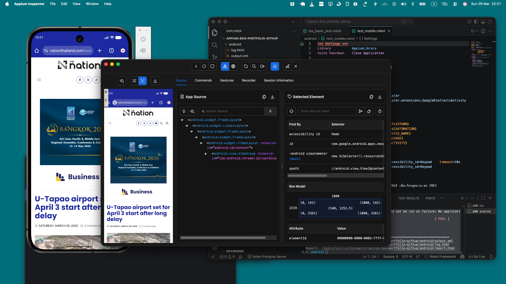
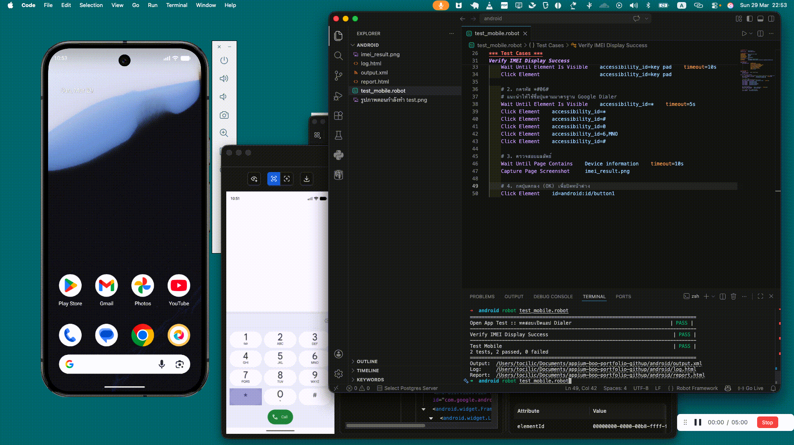
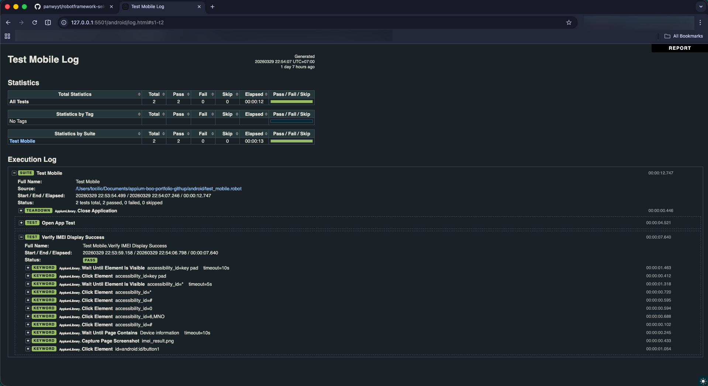
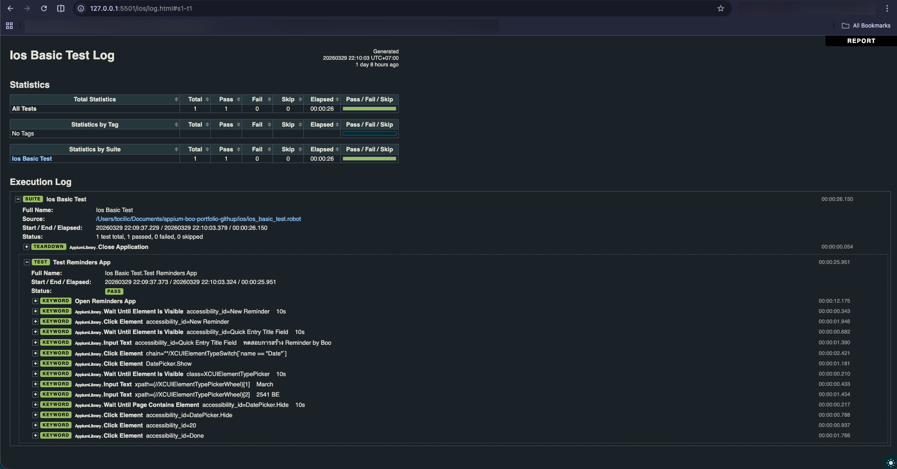

# 📱 Mobile App Automation Testing

## 🌟 The Prequel: From Web to Mobile

Previously, I showcased how to automate tests for **Websites** using a combination of Robot Framework and Selenium.

However, when we move from testing websites on a browser (like Chrome or Safari) to testing **Mobile Applications** (like the apps you download from the App Store or Google Play), things get a bit more challenging.

The great news is that because I already have a foundation in **Robot Framework**, I can bring almost all of that knowledge over! The main difference is the "driver" that talks to the app: instead of Selenium (for web), we use an industry-standard library called **Appium** (for mobile).

## 🧩 The Challenge: Why is Mobile Harder?

Testing a mobile app automatically is significantly more complex than testing a website. Here's why:

1. **Simulating the Devices:** I can't just open a web browser. I need to run an entire virtual phone on my computer! This means configuring **Android Studio** to create virtual Android phones (Emulators), and **Xcode** to create virtual iPhones (Simulators).
2. **Finding the Buttons:** On a website, finding the underlying code for a button is quite easy. On a mobile app, it is much more complex. I have to use a specialized tool called **Appium Inspector**. It connects to the virtual phone and acts like an X-ray, letting me see the hidden structure of the app so I can figure out the exact "Locator" (address) of a button to tell my script where to click.

Let's look at how I solved these challenges across two different platforms.

---

## 🤖 Android App

**The Goal:** Automatically testing the phone app and dial the keypad to check the device's IMEI number.

**How it works in action:**
First, I use **Appium Inspector** connected to an Android Emulator. In the screenshot below, you can see how I inspect the complex UI tree on the right side to find the exact locator for the app elements.

Next, the automated script runs at lightning speed, performing the task exactly as a human would:

**The Results:**
After the test finishes, Robot Framework generates a beautiful, easy-to-read report showing that every step was successful.

*(Tech Note: You can view the actual code for this test here: [`android/test_mobile.robot`](android/test_mobile.robot))*

---

## 🍏 iOS App

**The Goal:** Automatically open the built-in "Reminders" app on an iPhone and interact with it.

**How it works in action:**
Similar to Android, I set up Appium Inspector, but this time connected to an **Xcode iOS Simulator**. The way iOS builds apps is completely different from Android, so finding the correct locators requires a completely different approach and skill set!

Here is the automated script smoothly opening the Reminders app and completing its programmed tasks:

**The Results:**
Just like the Android mission, a comprehensive test report is automatically generated to prove the iOS test works perfectly.

*(Tech Note: You can view the actual code for this test here: [`ios/ios_basic_test.robot`](ios/ios_basic_test.robot))*

---

## 💡 Conclusion

This portfolio demonstrates that I can overcome the complex setup required for mobile automation (configuring Emulators, Simulators, and Appium Inspector) and successfully write automated, cross-platform tests for **both Android and iOS**.

Thank you for reading my mobile automation story!
