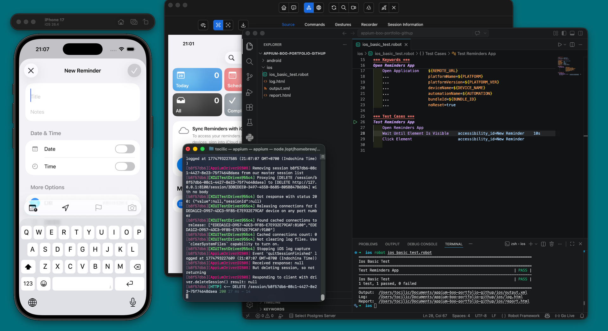
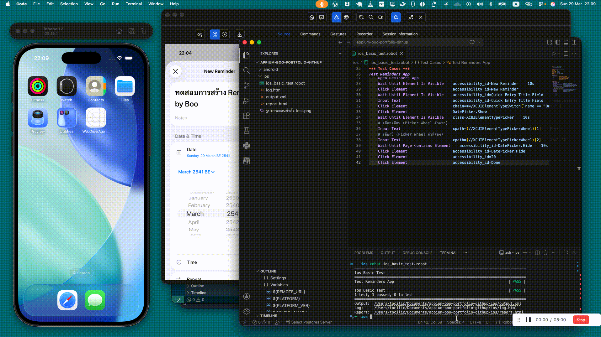

# 📱 Mobile App Automation Testing

## 🌟 จุดเริ่มต้น: จาก Web สู่ Mobile

ก่อนหน้านี้ ผมได้โชว์ให้ดูไปแล้วว่าเราสามารถเขียนโค้ดเพื่อทดสอบ **เว็บไซต์** แบบอัตโนมัติได้ยังไง โดยใช้การผสมผสานระหว่าง Robot Framework และ Selenium

แต่พอเราต้องย้ายจากการทดสอบเว็บไซต์บนเบราว์เซอร์ (อย่าง Chrome หรือ Safari) มาเป็นการทดสอบ **แอปพลิเคชันบนมือถือ** (เช่น แอปที่คุณโหลดจาก App Store หรือ Google Play) งานนี้มันก็จะมีความท้าทายเพิ่มขึ้นมาอีกสเต็ปนึงครับ

ข่าวดีก็คือ ด้วยความที่ผมมีพื้นฐานของ **Robot Framework** อยู่แล้ว ผมเลยสามารถเอาความรู้นั้นมาต่อยอดได้เกือบจะ 100% เลย! จุดที่ต่างออกไปหลักๆ ก็คือตัว "คนขับ (Driver)" ที่เอาไว้คุยกับแอปครับ: แทนที่เราจะใช้ Selenium (สำหรับฝั่งเว็บ) เราก็จะเปลี่ยนมาใช้เครื่องมือมาตรฐานระดับอุตสาหกรรมอย่าง **Appium** (สำหรับฝั่งมือถือ) แทน

## 🧩 ความท้าทาย: ทำไมแอปมือถือถึงเทสต์ยากกว่า?

การทำระบบทดสอบอัตโนมัติสำหรับแอปมือถือนั้นมีความซับซ้อนกว่าเว็บไซต์เยอะครับ นี่คือเหตุผลเบื้องหลัง:

1. **การจำลองอุปกรณ์:** เราไม่สามารถแค่เปิดหน้าเบราว์เซอร์ขึ้นมาได้ง่ายๆ ครับ ผมต้องรัน "มือถือเสมือน (Virtual Phone)" ขึ้นมาทั้งเครื่องบนคอมพิวเตอร์! นั่นหมายความว่าผมต้องตั้งค่าเซ็ตอัป **Android Studio** เพื่อสร้างโทรศัพท์ Android จำลอง (Emulators) และใช้ **Xcode** เพื่อสร้าง iPhone จำลอง (Simulators)
2. **การหาปุ่มและจุดต่างๆ บนหน้าจอ:** บนหน้าเว็บ การหาโครงสร้างโค้ดหลังบ้านสำหรับปุ่มนั้นค่อนข้างง่าย แต่ในแอปมือถือ มันซับซ้อนกว่านั้นมาก ผมต้องใช้เครื่องมือเฉพาะทางที่ชื่อว่า **Appium Inspector** ซึ่งมันจะเชื่อมต่อกับมือถือจำลองและทำหน้าที่เหมือนกล้อง X-ray ทำให้ผมมองเห็นโครงสร้างที่ถูกซ่อนไว้ของแอปได้ เพื่อที่ผมจะได้ระบุ "พิกัด (Locator)" ที่แม่นยำเป๊ะๆ สำหรับสั่งให้สคริปต์ของผมกดปุ่มได้อย่างถูกต้อง

เรามาดูกันดีกว่าครับว่าผมจัดการกับความท้าทายเหล่านี้ยังไง ผ่านโจทย์ของสองระบบปฏิบัติการที่ต่างกัน

---

## 🤖 ฝั่งแอป Android

**เป้าหมาย:** สั่งให้ระบบเปิดแอปโทรศัพท์ขึ้นมาเทสต์แบบอัตโนมัติ แล้วกดปุ่มตัวเลขบนแป้นพิมพ์เพื่อเช็คหมายเลข IMEI ของเครื่อง

**เบื้องหลังการทำงาน:**
เริ่มแรก ผมใช้ **Appium Inspector** เชื่อมต่อเข้ากับ Android Emulator ก่อน จากในภาพด้านล่าง คุณจะเห็นว่าผมกำลังแกะโครงสร้าง UI สุดซับซ้อนทางฝั่งขวา เพื่อหาพิกัดที่แม่นยำขององค์ประกอบต่างๆ ในแอป

หลังจากนั้น สคริปต์ที่เราเขียนไว้ก็จะรันแบบอัตโนมัติด้วยความเร็วแสง ทำตามขั้นตอนทุกอย่างเหมือนกับมีคนจริงๆ เป็นคนกดเลยครับ:

**ผลลัพธ์ที่ได้:**
พอระบบรันเทสต์เสร็จปุ๊บ Robot Framework ก็จะสร้างรายงานที่อ่านง่ายและสวยงามออกมาให้ เป็นการยืนยันว่าทุกขั้นตอนผ่านฉลุยครับ

*(เกร็ดความรู้สำหรับสายเทค: คุณสามารถเข้าไปดูซอร์ซโค้ดเบื้องหลังของการทดสอบนี้ได้ที่นี่ครับ: [`android/test_mobile.robot`](android/test_mobile.robot))*

---

## 🍏 ฝั่งแอป iOS

**เป้าหมาย:** สั่งให้ระบบเปิดแอป "การเตือนความจำ (Reminders)" ที่ติดมากับเครื่อง iPhone โดยอัตโนมัติแล้วจำลองการใช้งานตัวแอป

**เบื้องหลังการทำงาน:**
คล้ายๆ กับฝั่ง Android เลยครับ ผมตั้งค่า Appium Inspector ขึ้นมา แต่คราวนี้สลับหน้ากระดานมาเชื่อมต่อเข้ากับ **iOS Simulator ของ Xcode** แทน วิธีที่ iOS โครงสร้างแอปขึ้นมานั้นต่างจาก Android อย่างสิ้นเชิง ดังนั้นการหาพิกัด (Locator) ที่ถูกต้อง จึงต้องใช้วิธีการที่ปรับเปลี่ยนไปและอาศัยทักษะคนละมิติเลยครับ!

นี่คือภาพตอนที่สคริปต์อัตโนมัติกำลังเปิดแอป Reminders อย่างลื่นไหล และทำภารกิจที่ถูกโปรแกรมไว้จนเสร็จสิ้นครับ:

**ผลลัพธ์ที่ได้:**
เช่นเดียวกับมิชชันของฝั่ง Android ครับ มีรายงานผลการทดสอบแบบละเอียดถูกสร้างขึ้นมาอัตโนมัติ เป็นข้อพิสูจน์ว่าตัวเทสต์ของ iOS นั้นทำงานได้อย่างสมบูรณ์แบบ

*(เกร็ดความรู้สำหรับสายเทค: คุณสามารถเข้าไปดูซอร์ซโค้ดเบื้องหลังของการทดสอบนี้ได้ที่นี่ครับ: [`ios/ios_basic_test.robot`](ios/ios_basic_test.robot))*

---

## 💡 สรุปทิ้งท้าย

โปรเจกต์ในพอร์ตโฟลิโอชิ้นนี้ถือเป็นการโชว์ให้เห็นว่า ผมสามารถก้าวข้ามความซับซ้อนในการเตรียมระบบสำหรับทำเทสต์บนมือถือได้ (ตั้งแต่ทักษะการตั้งค่า Emulators, Simulators ไปจนถึงการใช้งาน Appium Inspector) และสามารถเขียนโค้ดเพื่อเซ็ตระบบทดสอบอัตโนมัติที่รันข้ามแพลตฟอร์มได้จริง **ทั้งบนระบบ Android และ iOS** ครับ

ขอบคุณมากๆ นะครับที่แวะเข้ามาอ่านเรื่องราวเส้นทางการทำ Mobile Automation ของผมจนจบ!
