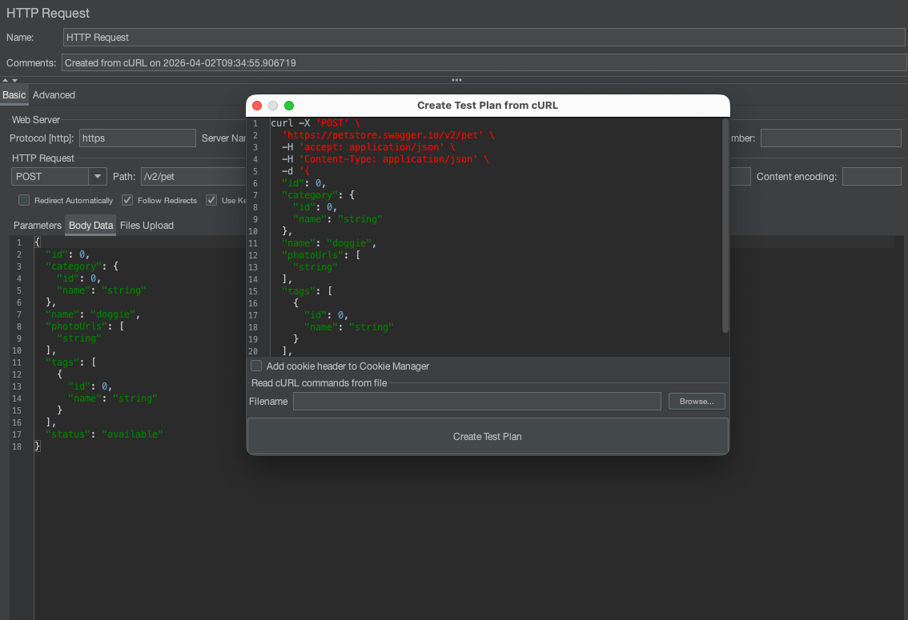
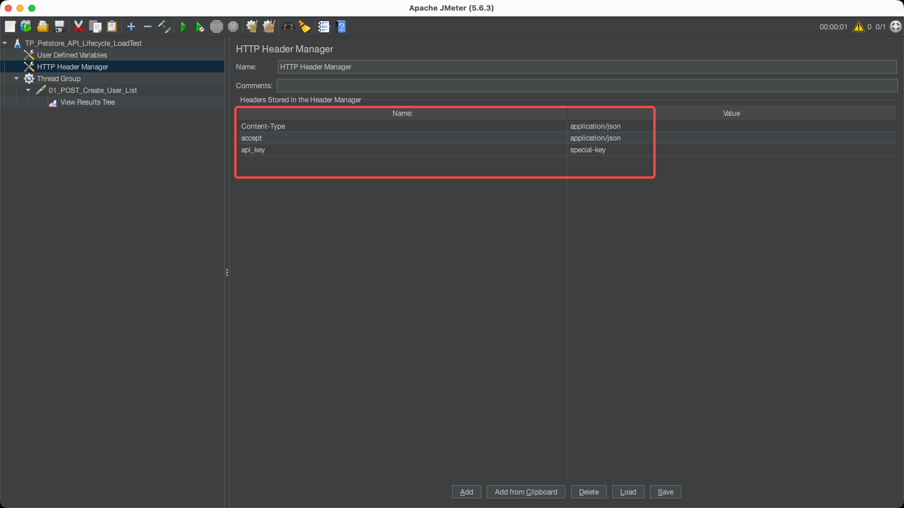
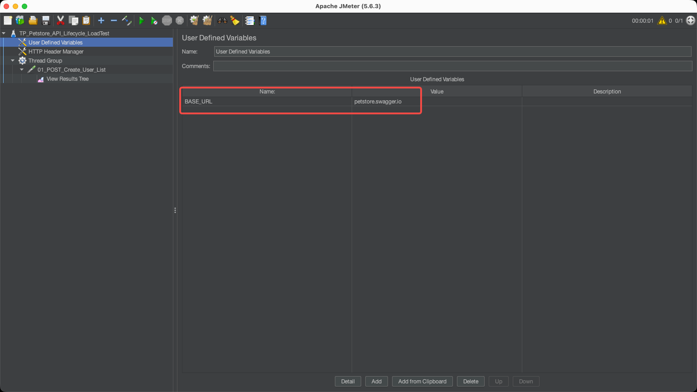
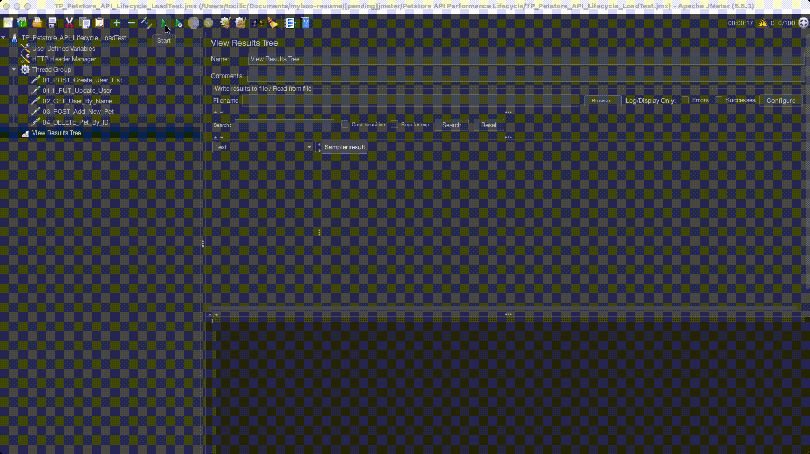
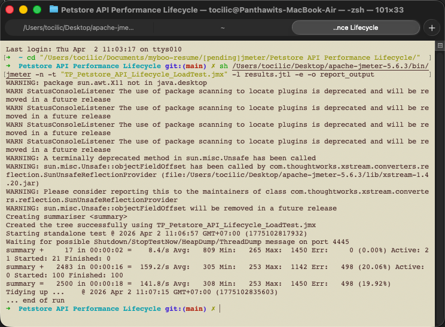
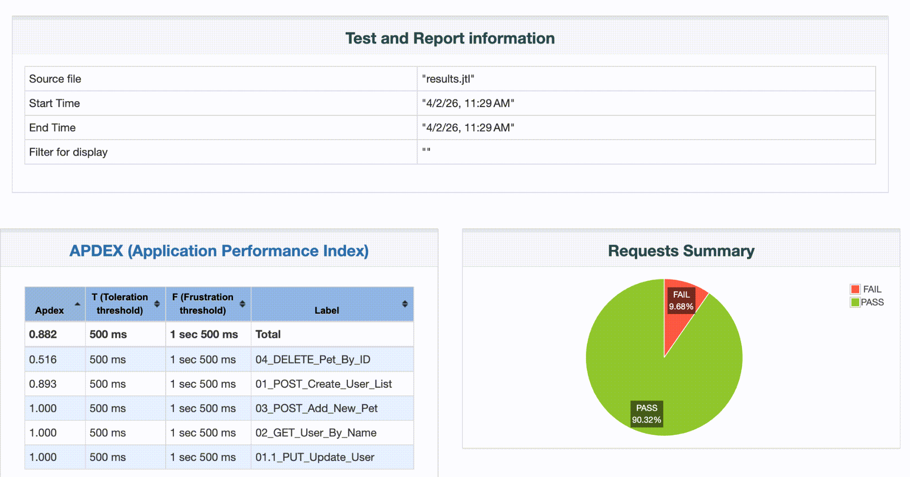

# 🚀 JMeter: ราชาแห่งการจำลองโหลด

ยินดีต้อนรับสู่ส่วนของ Performance ในพอร์ตโฟลิโอของผมครับ! 🌪️

ในขณะที่ Functional Testing มีหน้าที่เช็คว่าฟีเจอร์ "ใช้งานได้ไหม" สำหรับคนๆ เดียว แต่ **Performance Testing** มีหน้าที่เช็คว่า "ระบบจะล่มไหม" เมื่อทุกคนแห่มาใช้งานพร้อมกันครับ ในโปรเจกต์นี้ผมใช้ **Apache JMeter** เพื่อจำลองพฤติกรรมผู้ใช้งานนับร้อยๆ คนพร้อมกัน เพื่อขุดหา "คอขวด" และจุดเปราะบางของระบบครับ

---

## 🧐 ทำไมต้อง JMeter?

ถ้าเปรียบเทียบ Postman เป็นการเช็คว่า "ประตูเปิดได้ไหม" และ Playwright เป็นการ "เดินสำรวจบ้าน" เจ้าน้อง **JMeter** ก็คือการเช็คว่า "พื้นบ้านจะถล่มไหม" ถ้ามีคนพันคนขึ้นมาเต้นบนพื้นพร้อมๆ กันครับ

---

## 🏗️ เส้นทางการทำงาน: Performance Workflow ของผม

ผมปรับจูนเวิร์กโฟลว์ของ JMeter ให้รวดเร็ว แม่นยำ และพร้อมใช้งานในสนามจริงที่สุดครับ

### Step 1: สร้างสคริปต์ความไวแสง (cURL Import)
การมานั่งสร้าง HTTP Request ทีละตัวมันช้าเกินไปครับ ผมใช้ฟีเจอร์ **cURL Import** เพื่อปั้นโครงสร้างคำขอขึ้นมาทันที ทำให้ผมมีเวลาเหลือไปโฟกัสที่ "ลอจิกการเทส" จริงๆ ครับ

### Step 2: จัดการตัวแปรแบบห่วงโซ่ (Dynamic Variable Chaining)
การจำลองที่เหมือนจริงต้องมีข้อมูลที่ไหลลื่นครับ ผมใช้ **JSON Extractors** เพื่อเจาะเอาเลข ID จากเซิร์ฟเวอร์ แล้วส่งต่อไปยังภารกิจถัดไป (Variable Chaining) ครับ

  
  

*(จัดการรหัสความปลอดภัยและส่งต่อค่า ID แบบไร้รอยต่อ)*

### Step 3: จากหน้าจอ GUI สู่สมรภูมิ CLI
ผมจะใช้หน้าจอ GUI สำหรับการสร้างและดีบั๊กสคริปต์เท่านั้นครับ แต่สำหรับการยิงโหลดจริง... ผมจะสลับไปโหมด **Non-GUI (CLI)** เพื่อประหยัดทรัพยากรเครื่องและได้ผลลัพธ์ที่แม่นยำที่สุดครับ

  
  

*(เปลี่ยนจากหน้าจอดีบั๊กที่คุ้นตา สู่การรันผ่าน Terminal ที่ทรงพลัง)*

---

## 🎬 กรณีศึกษา: ภารกิจ "ทลายกำแพง 404" (The 404 Wall Breaker)

นี่คือเรื่องราวของผมตอนหาวิธีแก้ปัญหา "ข้อมูลชนกัน (Data Collision)" อย่างหนักหน่วงยามจำลองผู้ใช้ 100 คนพร้อมกันครับ

### บทที่ 1: การบุกครั้งแรก (พังพินาศ!) 
การรันรอบแรกส่งผลให้ Error Rate พุ่งสูงถึง **20%** สาเหตุเพราะผู้ใช้ร้อยคนกำลัง "แย่งกันลบ" ข้อมูลตัวเดียวกันอยู่ครับ!

### บทที่ 2: กับดักตัวแปรสุ่ม
ผมพยายามแก้ด้วยการใส่ค่าสุ่ม (Randomizer) แต่ดันตกหลุมพรางของ JMeter เข้าเต็มเปา เพราะค่าสุ่มนั้นถูกเจนแค่ "ครั้งเดียว" ตอนเริ่มงาน... ทำให้ผู้ใช้ทั้ง 100 คนยังต้องมาแย่งลบเลขเดิมซ้ำกันอยู่ดี!

### บทที่ 3: ชัยชนะที่ไร้รอยต่อ
ผมงัดเทคนิคระดับซีเนียร์มาใช้ คือการสร้าง **"ตัวแปรสดใหม่ (On-the-fly Variable)"** ที่บังคับให้ผู้ใช้ทุกคนต้องทำการ "สุ่มเลขใหม่" ทุกครั้งเมื่อมีการสร้างข้อมูล... 
**ผลลัพธ์คือ? Error Rate กลายเป็น 0.00% ทันที จากทั้งหมด 25,000 Request!** 🎉

---

## 📊 วิวัฒนาการจากรอบสู่รอบ

จากการเก็บข้อมูล 3 รอบการทดสอบ จะเห็นได้ชัดเจนเลยว่าสคริปต์ของผมเติบโตจากแค่ "พื้นฐาน" ไปสู่ระดับ **พร้อมใช้งานจริง (Production-Ready)**

| Metric | รอบที่ 1 (เริ่ม) | รอบที่ 2 (จูน) | รอบที่ 3 (สำเร็จ) |
|---|---|---|---|
| **Error Rate** | 19.92% ❌ | 9.68% ⚠️ | **0.00% ✅** |
| **Throughput** | 142 req/sec | 142 req/sec | **433 req/sec 🚀** |
| ** mean Response** | 308 ms | 312 ms | **311 ms ⚡** |

> 🔗 **[คลิกเพื่อดูรายงานสรุปผล HTML แบบ Interactive](petstore-api-performance/report_output/index.html)**

---

## 💡 ก่อนจะจากกัน

Performance Testing คือมากกว่าแค่การกดปุ่ม 'Run' แต่มันคือการเข้าใจพฤติกรรมของข้อมูลยามเจอกันที่ "คอขวด" และการสร้างสคริปต์ที่แข็งแกร่งพอจะรับมือกับคลื่นมหาชนได้ครับ

**ผมพร้อมแล้วที่จะพาโปรเจกต์ของคุณไปทดสอบขีดจำกัด และมั่นใจได้เลยว่าระบบจะยังยืนตระหง่านอยู่ได้ยามที่ฝูงชนแห่แหนมาใช้งานจริงครับ!** 🚀
