# 🎼 Maestro: The New "Conductor" of Mobile Testing

Hey there! 👋 Welcome to my Maestro journey. If you’ve ever felt the headache of setting up mobile automation, you’re not alone. I picked up **Maestro** to see if it really is the "easiest mobile testing framework" out there—and spoiler alert: it absolutely is! 🚀

---

## 🌟 Why I Added Maestro to My Toolkit

I already have a solid foundation in **Appium**, which is a powerhouse but can be quite "heavy" to set up and maintain. I wanted something modern, lightweight, and resilient. 

Maestro gives me:
-   **Instant Connection:** No more messy driver configs. Just open an emulator and start testing.
-   **A Friendly Face:** The UI is clean and even gives you "success badges" when tests pass—which is weirdly satisfying! 🏅

  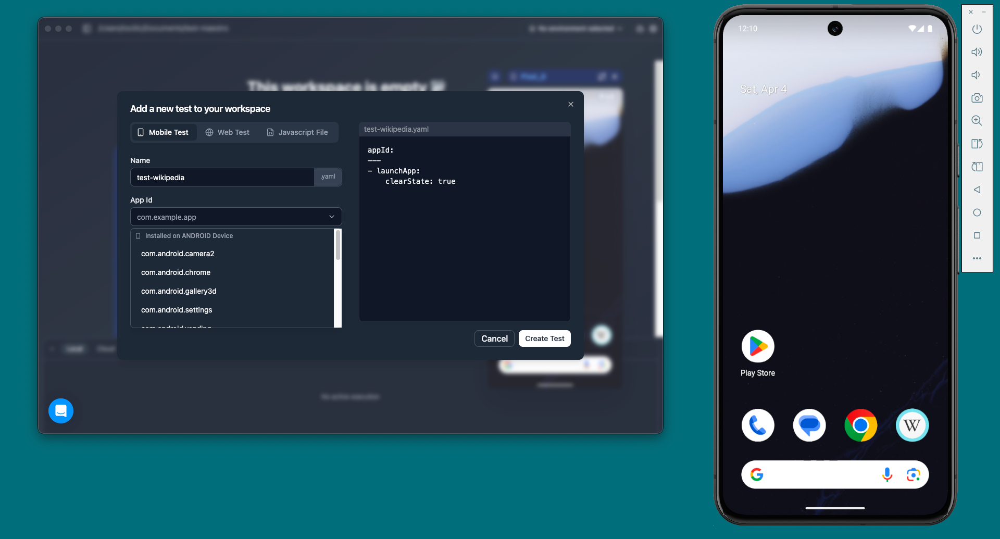
  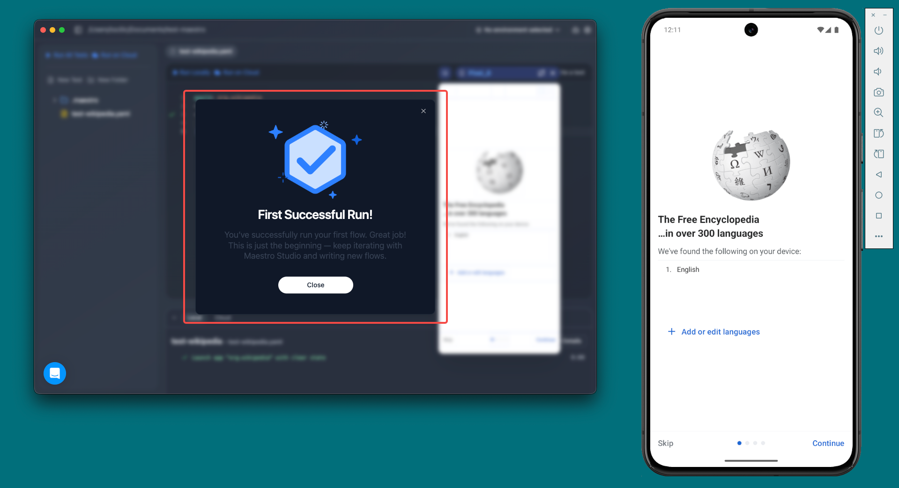

*(Instant plug-and-play setup and satisfying feedback)*

---

## 🏗️ The Project: Stress-Testing the WDIO App

To really see what Maestro could do, I tested it against the `WDIO Native App`—a standard app often used to challenge QA frameworks. 

  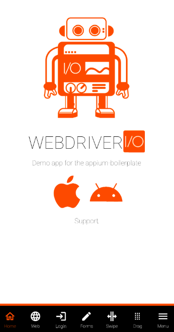
  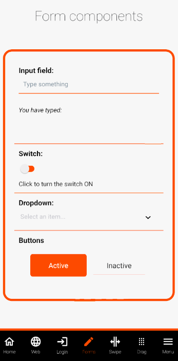

Here is how I navigated the journey:

### Step 1: The Built-in Inspector (A Lifesaver)
Finding elements shouldn't be a guessing game. Maestro’s built-in inspector lets me click on the UI and it automatically suggests the best "address" (locator) for that element.
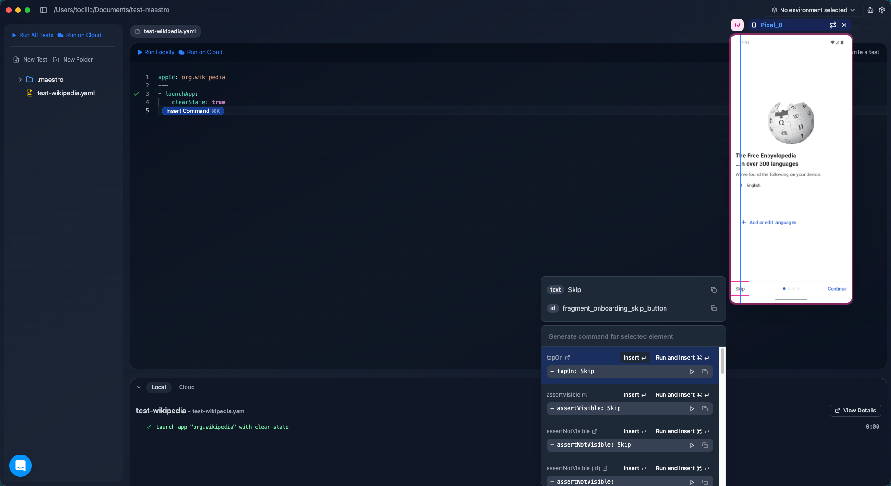

### Step 2: Outsmarting Random Pop-ups
Mobile apps love throwing random rating prompts or updates at you. I used **Conditional Logic (`runFlow`)** to say: *"If you see a pop-up, dismiss it. If not, just carry on!"* It killed test flakiness instantly.
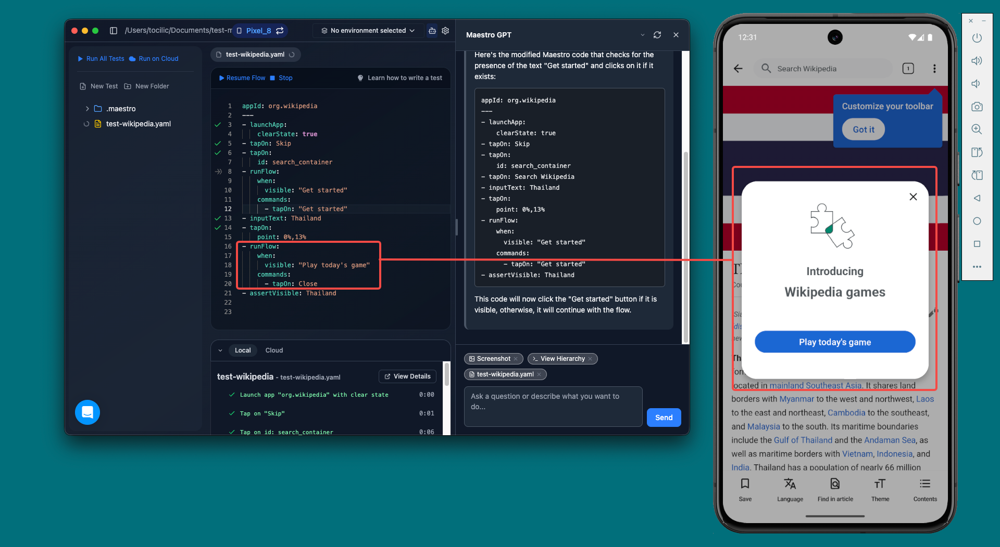

### Step 3: Precise Targeting with Relative Locators
When two buttons look exactly the same, I used **Relative Locators** to tell Maestro: *"Find the button that is below 'Title A' but above 'Button B'."* No more clicking the wrong thing!
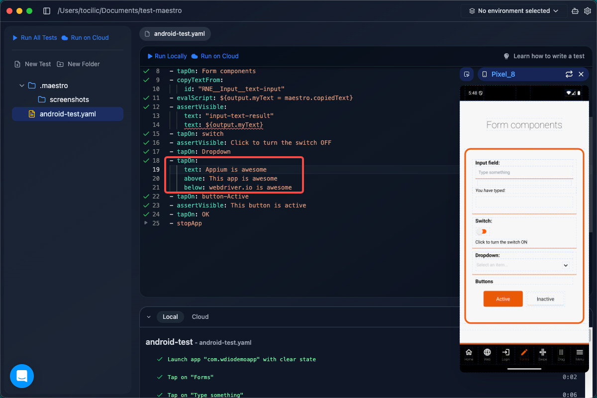

### Step 4: Adding "Brainpower" with JavaScript
Sometimes YAML isn't enough. I used `evalScript` to inject pure JavaScript—allowing me to copy text from one screen, save it to memory, and validate it on a completely different screen.

---

## 🤖 Platform Showcase: Android vs. iOS

### Android (Local Execution)
Testing locally on my Android Emulator was lightning fast. Below you can see the terminal response and the UI test running flawlessly.

  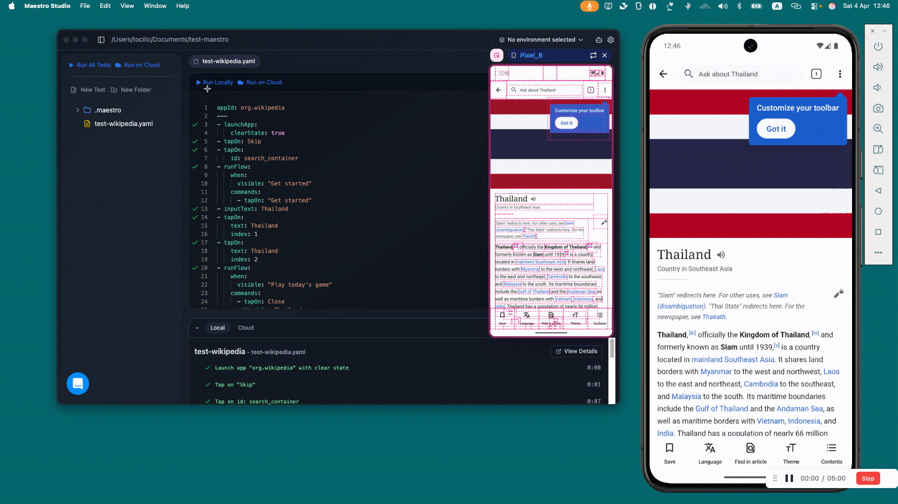
  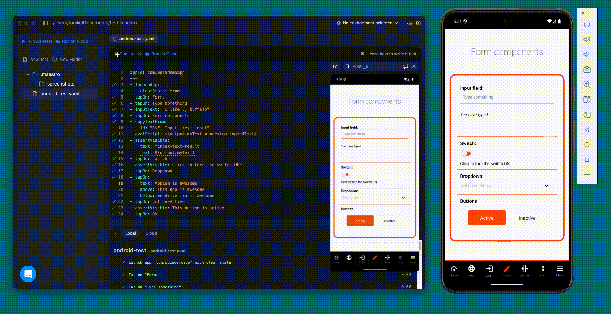

### iOS (Conquering the Scrollwheel)
iOS brought its own challenges. I used the **Locator ID** system for stability, but had to overcome the native **Scrollwheel** which behaves like one giant box.

  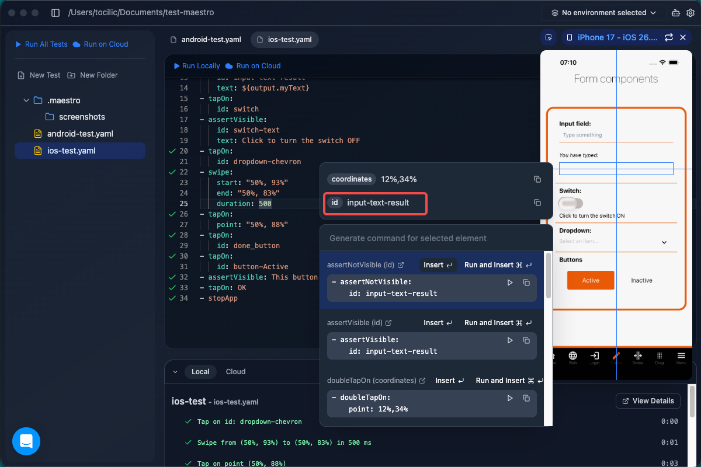
  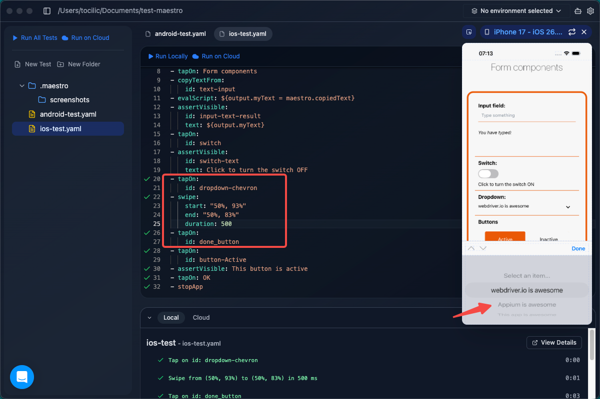

**My Solution:** I mapped the precise **X/Y Screen Coordinates** to simulate a human swipe gesture. 
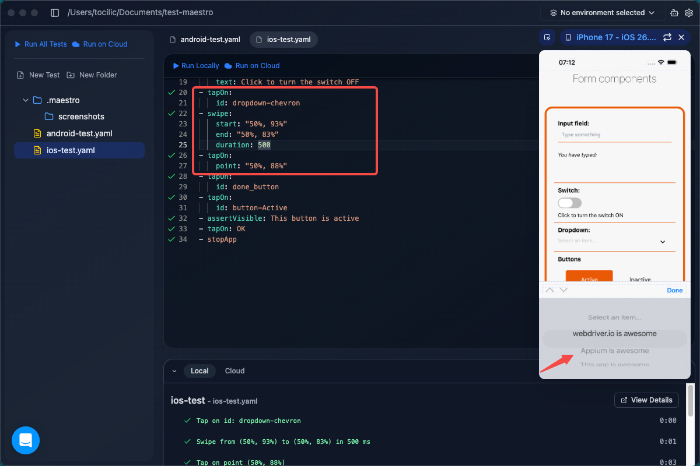

**Final iOS Result:**
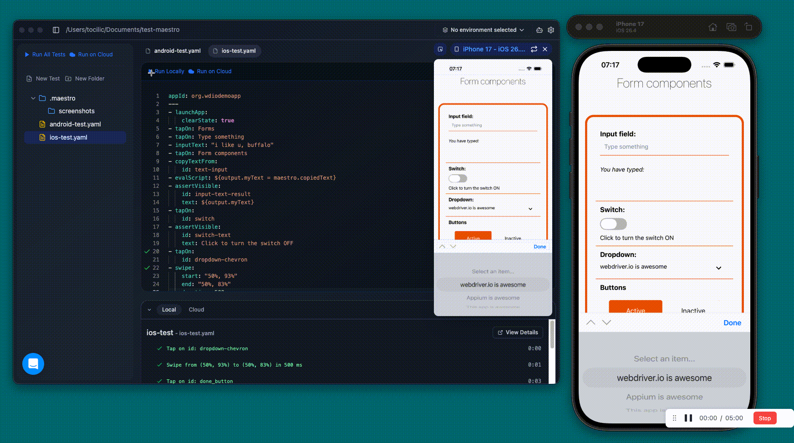

---

## ☁️ The Final Boss: Maestro Cloud

I took the test to the next level by executing it on **Maestro Cloud**. This allows me to upload the APK and run tests in the background, exactly like a professional CI/CD pipeline.

  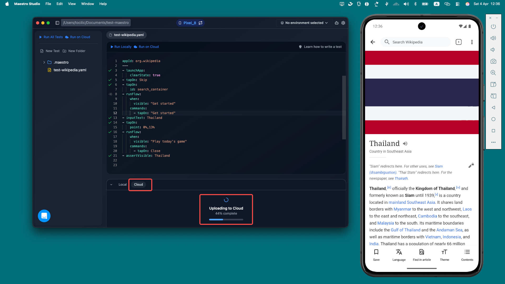
  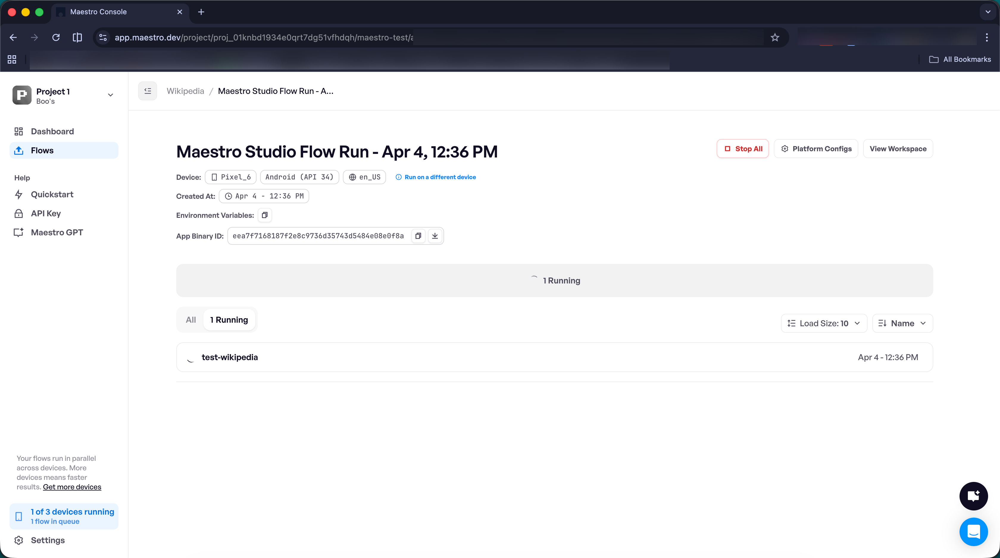

**The best part? Visual Debugging.** Maestro generates a step-by-step video of the test run.
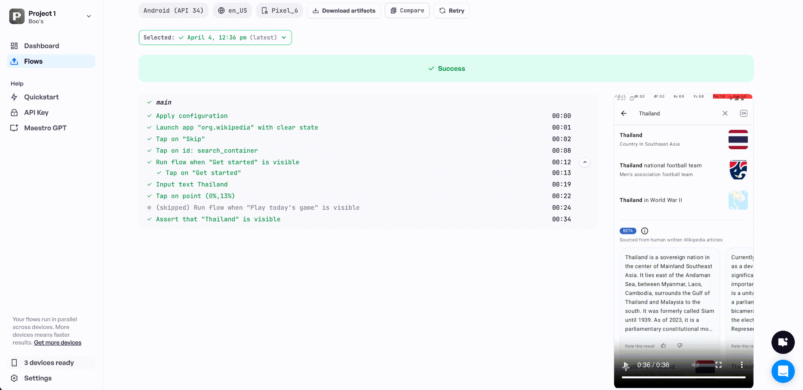

---

## 💡 Conclusion

Maestro is an absolute powerhouse for modern mobile QA. By combining YAML's simplicity with JavaScript's depth, I’ve built a cross-platform testing suite that is fast, reliable, and scalable.

**Thanks for exploring my Maestro journey! 🚀**
