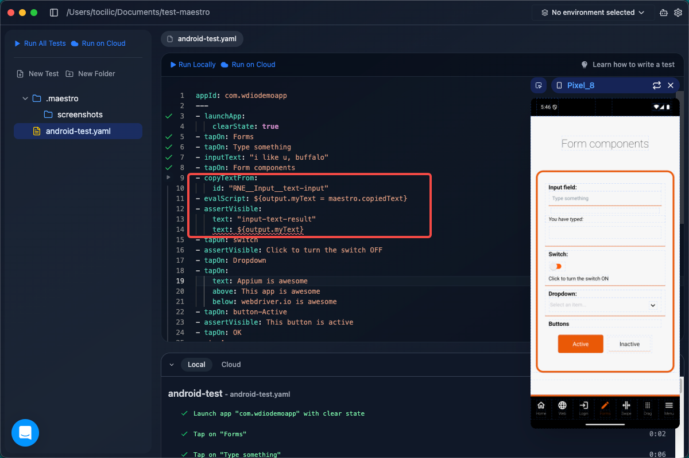

# 🎼 Maestro: Next-Gen Mobile UI Testing

Hey there! 👋 Welcome to my Maestro portfolio. If you've ever felt the pain of mobile automation, you're not alone. I decided to pick up **Maestro** to see if all the hype about it being the "easiest mobile testing framework" was true — and plot twist: it actually is! 🚀

---

## 🌟 Why I Added Maestro to My Toolkit

I already had a solid foundation in **Appium** for mobile testing. Appium is a powerhouse, but it comes with a steep learning curve: complex environment setups, slow execution speeds, and occasional driver flakiness. 

I wanted to explore a more modern, lightweight, and resilient alternative. Enter **Maestro**:

- **Instant Connection**: No massive driver configs. If an emulator is open, Maestro connects instantly!
- **User-Friendly UI**: Writing tests shouldn't be boring. Maestro proves that!
- **Low-Code Feel**: It uses simple YAML syntax but allows powerful JavaScript injections. 

**Look at how quickly it connects directly to an active emulator:**

*(Instant plug-and-play setup without touching a single environment variable)*

**And look at this cute UI!**

*(Getting little success badges when your tests pass is weirdly satisfying! 🏅)*

---

## 🏗️ The Mini-Project: Testing the WDIO App

To really test its limits, I didn't want to just do a simple "Hello World". I grabbed the `android.wdio.native.app.v2.2.0.apk` application. This is a standard app normally used to test Appium, but I wanted to see how Maestro handled it.

Here is what the app looks like:

  
  

### 📌 1. The Built-in Inspector is a Lifesaver

No more struggling to find element locators. Maestro comes packaged with a fantastic built-in Inspector. You just click around your app, and it auto-generates the best locators to use in your test scripts.

*(The UI Inspector makes finding elements a visual drag-and-drop experience.)*

### 📌 2. Handling Unpredictable Pop-ups

Mobile apps love throwing random rating requests, newsletter prompts, or system updates at your face. To handle this, I used **Conditional Logic** (`runFlow`). 
Basically, I told the script: *"Hey, if you see this pop-up, dismiss it. If not, just carry on!"* This killed test flakiness instantly.

*(Using YAML logic to gracefully dismiss random system interruptions.)*

### 📌 3. Pinpoint Accuracy with Relative Locators

What happens when multiple buttons on a screen have the exact same text? I used **Relative Locators** to tell Maestro: *"Find this text, but ensure it is positioned directly below *this* element and above *that* element."* No more getting confused and clicking the wrong button!

*(Solving element text duplication issues elegantly with relative positioning)*

### 📌 4. The Power of JavaScript via `evalScript`

Sometimes, you need to store variables, copy generated text, and compare states later in the test. Maestro allows injecting pure JavaScript right into the flow! 
I used `evalScript` to copy text from one screen, save it to memory, and validate it dynamically against another. Powerful and flexible! ⚡

*(Mixing simple YAML with JS validation logic for cross-screen data checking)*

---

## 🤖 Automating Android (Local Execution)

First, I ran everything locally down on my Android Emulator. It was lightning fast. Below is the smooth, real-time command execution when testing locally.

*(Notice how fast the commands are executed directly in the terminal)*

And here is the actual UI test running flawlessly on the WDIO Android app:

*(Filling forms, swiping, and validating text locally!)*

---

## 🍏 The iOS Challenge

Translating the test to iOS wasn't a simple copy-paste. The App IDs were different, but there were some massive advantages and some tricky hurdles.

**The Advantage: Deep Locator IDs**
iOS natively maps fantastic locator IDs to almost every element. Instead of relying heavily on matching text, I could directly target IDs, which is much more stable!

*(Relying on precise iOS Locator IDs instead of text-matching)*

**The Hurdle: Native iOS Scrollwheels**
Unlike standard dropdowns, iOS renders scrollwheels as one giant element box. To interact with it, I couldn't just "select" text — I had to map precise **X/Y Screen Coordinates** to simulate human swipe and tap gestures! 👈👆

*(The stubborn native iOS scrollwheel that behaves like a single element)*

*(Hardcoding exact screen coordinates to conquer the scrollwheel)*

**The execution was beautiful:**

*(The exact same E2E flow executing flawlessly on the iOS Simulator!)*

---

## ☁️ The Final Boss: Maestro Cloud

I took the test to the next level by executing it on **Maestro Cloud**. Uploading the `.apk` and the test script mirrored a seamless CI/CD pipeline. No local resources consumed!

**The Setup:**
Maestro offers a generous free trial so you don't even need a credit card to spin up a cloud test execution.

*(Setting up the Maestro Cloud Free Trial)*

*(Uploading the Test Scripts and the APK directly to the cloud runner)*

**Visual Debugging Output:**
The absolute best part? **Visual Debugging output**. If a test fails (or passes) on the cloud, Maestro generates a video broken down step-by-step. Instead of digging through huge walls of text logs, I could just watch exactly where the app choked.

*(The incredible step-by-step video playback from a Maestro Cloud run.)*

---

## 💡 Conclusion

This project proved that **Maestro** is an absolute game-changer for mobile test automation. By leveraging conditional flows, Javascript injections, relative locators, and precise coordinate mapping, I built highly resilient, cross-platform E2E tests for both Android and iOS. 

It feels like a massive leap forward in low-code abstraction while maintaining the power to handle complex UI vectors.

Thanks for checking out my Maestro journey! 🚀
