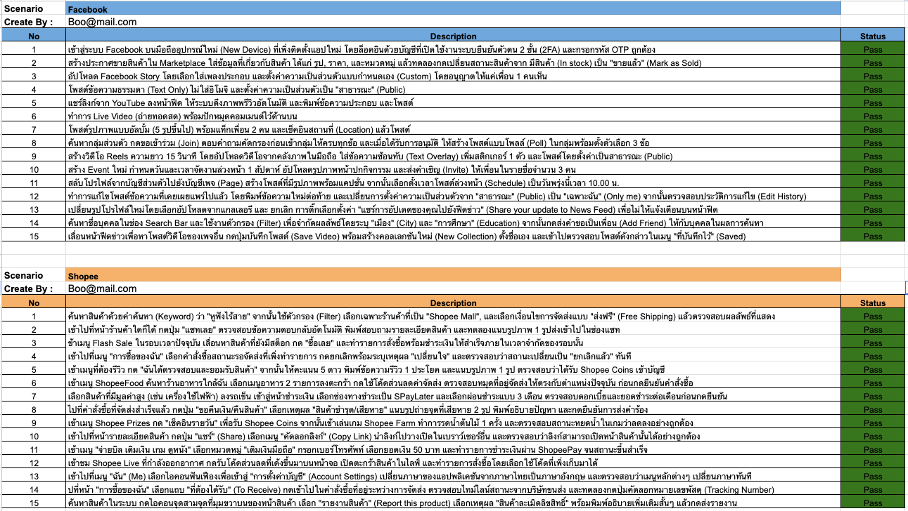
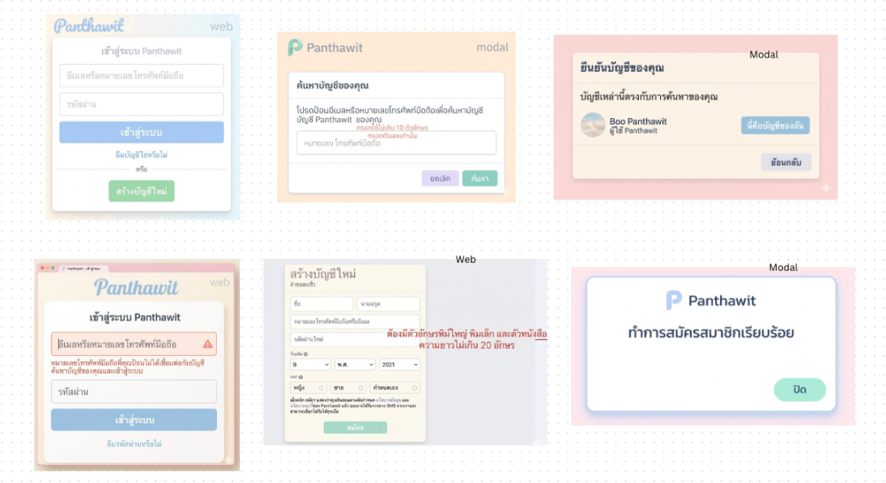
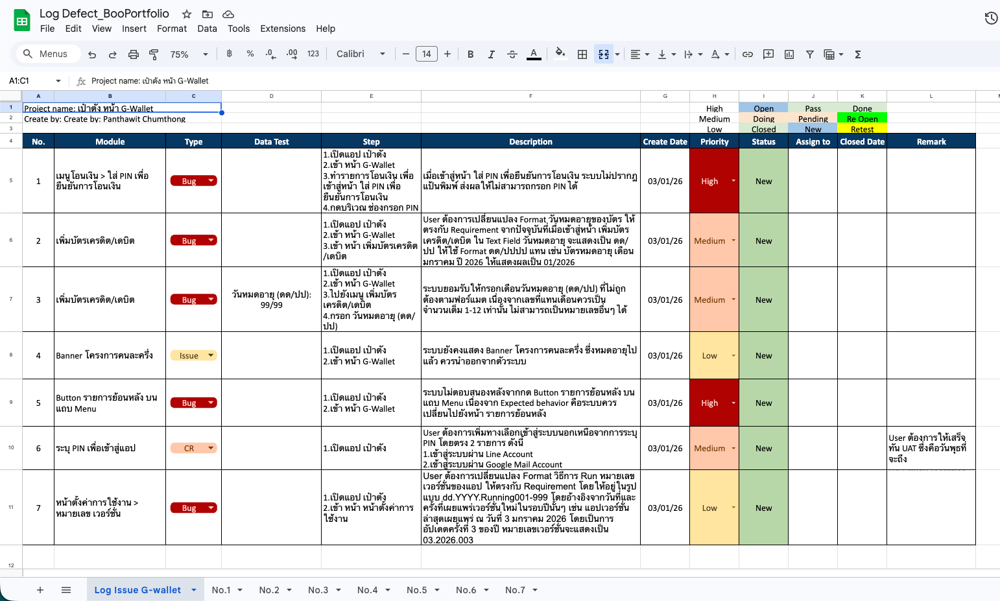
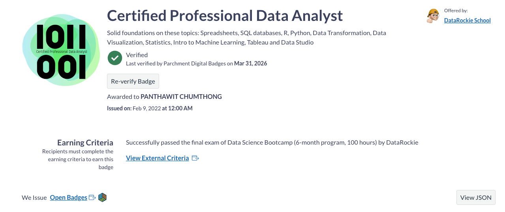

# 🕵️‍♀️ Manual Testing Portfolio : Panthawit Chumthong

## 👋 Introduction: What is Manual Testing?

**Manual Testing** is the process of testing software where a QA professional manually assumes the role of an end-user to execute test cases and verify the application's behavior. Instead of relying on automated scripts or tools, manual testers actively explore the software to identify defects, logical errors, and unexpected behaviors before they reach the customer.

It's essentially putting ourselves in the shoes of the real user, blending an understanding of product requirements with human intuition, logical reasoning, and testing techniques to ensure the software is fully functional, user-friendly, and of the highest quality.

---

## 🛠️ My Capabilities as a Software Tester

As a Software Tester, my focus goes beyond merely finding bugs. I am passionate about preventing issues at the root cause and collaborating closely with the team to elevate the overall quality of the product.

---

## 📝 Test Scenarios

A **Test Scenario** is a high-level documentation of a specific functionality or feature that can be tested, answering the question *"What needs to be tested?"*

For example, I have designed comprehensive manual test scenarios for real-world platforms like **Facebook** and **Shopee** to cover various happy paths and edge cases at a high level.

👉 **[Click here to view the Facebook &amp; Shopee Test Scenarios Spreadsheet](https://docs.google.com/spreadsheets/d/e/2PACX-1vTOp_3bO7NPoGAcIENB0GW57Oqk09TYd4_fbdeod5ZB_Ks_UE4QqD8geZDOc4zt0x0bPc5ueseOrEYG/pubhtml?gid=648465421&single=true)**

  

---

## 🔬 Test Case Design Projects

From a scenario, we derive multiple detailed **Test Cases** that provide step-by-step instructions on *"How to test it?"* — ensuring every flow is thoroughly validated. Below are examples of my work where I have demonstrated my analytical skills in breaking down complex requirements into testable chunks.

### 📌 Project 1: Login Screen Mockup Testing

For this project, I created comprehensive test cases derived entirely from a static UI mockup of a Login Page. Despite not having a live, interactive system to test against, I successfully extracted the requirements and identified all potential test cases and edge behaviors based purely on the provided design.

**The Mockup Requirement:**

  

**The Resulting Test Cases:**
Because the preview image below is condensed, I highly recommend checking out the full detailed document!
👉 **[Click here to view the full Login Test Cases Spreadsheet](https://docs.google.com/spreadsheets/d/e/2PACX-1vTOp_3bO7NPoGAcIENB0GW57Oqk09TYd4_fbdeod5ZB_Ks_UE4QqD8geZDOc4zt0x0bPc5ueseOrEYG/pubhtml?gid=1095342547&single=true)**

  

### 📌 Project 2: Kru P'Beam Web - Search & Filter Page

This project focuses on the **Search and Filter Page** of the "Kru P'Beam" web system, which functions similarly to a restaurant or travel recommendation website. I designed detailed test cases to validate the accuracy of search algorithms, output results, and various combinations of data filters.

👉 **[Click here to view the Search &amp; Filter Page Test Cases Spreadsheet](https://docs.google.com/spreadsheets/d/e/2PACX-1vTOp_3bO7NPoGAcIENB0GW57Oqk09TYd4_fbdeod5ZB_Ks_UE4QqD8geZDOc4zt0x0bPc5ueseOrEYG/pubhtml?gid=63326685&single=true)**

  

### 📌 Project 3: Kru P'Beam Web - Register Form Testing

For this project, I crafted detailed form testing cases specifically for the **Registration Page**. The focus was on input field validation, error handling, password requirements, and verifying the overall user registration flow.

👉 **[Click here to view the Register Page Test Cases Spreadsheet](https://docs.google.com/spreadsheets/d/e/2PACX-1vTOp_3bO7NPoGAcIENB0GW57Oqk09TYd4_fbdeod5ZB_Ks_UE4QqD8geZDOc4zt0x0bPc5ueseOrEYG/pubhtml?gid=1305237897&single=true)**

*(💡 Note: The provided link currently points to the same spreadsheet tab as Project 2. If they are in different tabs, feel free to update the `gid=` parameter in the URL later!)*

  

---

## 🐛 Defect Logging & Bug Reports

Finding bugs is only half the battle; documenting them effectively is equally important. I have experience in writing clear, actionable, and detailed bug reports that help developers reproduce and fix issues efficiently. A good defect log includes comprehensive steps to reproduce, expected vs. actual results, severity/priority assessments, and visual evidence.

Below is an example of my structured defect logging documentation:

👉 **[Click here to view the full Defect Logging Spreadsheet](https://docs.google.com/spreadsheets/d/e/2PACX-1vSXxP0PToKwjsIauY9rEcxZQP8VS57FG3BZCIPCDk0OIwjvus4trSvVIcivXy5VmHyRy7d9SPhgNJyE/pubhtml)**

  

---

## 📊 Test Reporting & Data Visualization

Writing tests and logging bugs are crucial, but presenting the results clearly to stakeholders is what drives informed decisions. Drawing from my previous experience in roles that heavily utilized spreadsheets, combined with my **Certified Professional Data Analyst** background, I excel at transforming raw testing data into highly visual, easy-to-understand test reports.

My reports provide instant visibility into overall quality, pass/fail metrics, and project health, allowing product owners and developers to quickly grasp the current state of the application.

  

---

## 🎓 Certifications

My foundation in quality assurance and data analysis is backed by the following professional certifications:

### 1. Manual Testing

I have successfully completed the comprehensive **Manual Testing** course from **Software Testing By P'Beam**, which certifies my strong foundation in software quality assurance methodologies, test case design, defect logging, and best practices.

  

 

### 2. Certified Professional Data Analyst

This certification reinforces my analytical mindset, ensuring I can structure test data effectively, identify patterns in defects, and create insightful visualizations for test reporting.

  

---

## 🤖 Why Manual Testing Will NEVER Die

In an era where **Automated Testing** plays a crucial role in reducing repetitive tasks and accelerating feedback loops, many might wonder: *"Will Manual Testing eventually disappear?"*

The answer is: **Absolutely not.**

Automated tests are excellent at *checking expectations*—they verify what they are explicitly programmed to verify. However, automation cannot perceive the **User Experience (UX)**. It cannot judge if an interface feels intuitive, understand complex and unpredictable human behaviors, or evaluate nuanced business logic in the way a human brain can.

Manual Testing is not an outdated practice; it is the **fundamental foundation of Quality Assurance.** The better we understand the system and the more comprehensive our manual test cases are, the more robust and effective our automated testing framework will become.
