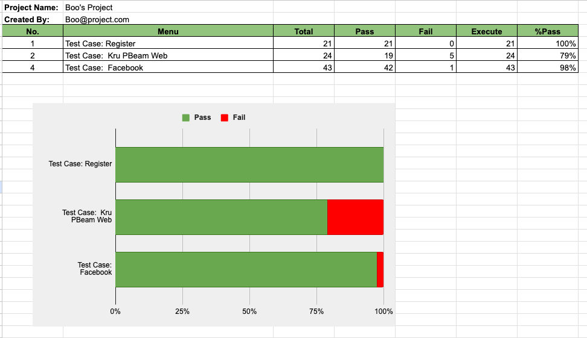

# 🕵️‍♂️ Manual Testing: เพราะเบื้องหลังของคุณภาพคือ "หัวใจของผู้ใช้งาน"

ยินดีต้อนรับเข้าพักชมพอร์ตโฟลิโอในส่วนของ Manual Testing ของผมครับ! สำหรับผมแล้ว การเทสระบบไม่ใช่แค่การ "หาบั๊ก" แต่มันคือการ "ทำความเข้าใจ" ว่าผู้ใช้งานเขารู้สึกอย่างไร และจะทำยังไงให้ประสบการณ์ของเขาลื่นไหลและดีที่สุด 

ในหน้านี้ ผมจะพาทุกคนไปย้อนรอยดูการทำงานของผม ตั้งแต่การเริ่มวางแผนไปจนถึงการออกรายงานสรุปภาพรวมคุณภาพของโปรดักต์ มาเริ่มเดินทางไปพร้อมกันเลยครับ! 🚀

---

## 🎨 Step 1: เริ่มต้นจากการมองภาพรวม (Test Scenarios)

ก่อนที่จะลงลึกไปในรายละเอียด ผมมักจะเริ่มจากการถอยออกมามองภาพกว้างก่อนเสมอ โดยตั้งคำถามว่า *"อะไรคือสิ่งที่ผู้ใช้งานต้องการทำจริงๆ?"*

เพื่อขัดเกลาทักษะนี้ ผมได้ลองวิเคราะห์แพลตฟอร์มระดับโลกอย่าง **Facebook** และ **Shopee** เพื่อวาง Scenario ในภาพรวมให้ครอบคลุม ทั้งเส้นทางหลักที่ควรจะเป็น (Happy Path) ไปจนถึงเคสที่อาจจะเกิดขึ้นได้ยาก (Edge Cases) เพื่อให้มั่นใจว่าจะไม่มีจุดสำคัญไหนตกหล่นไป

👉 **[ลองดูตัวอย่าง Facebook & Shopee Scenarios ได้ที่นี่ครับ](https://docs.google.com/spreadsheets/d/e/2PACX-1vTOp_3bO7NPoGAcIENB0GW57Oqk09TYd4_fbdeod5ZB_Ks_UE4QqD8geZDOc4zt0x0bPc5ueseOrEYG/pubhtml?gid=648465421&single=true)**

  

---

## 🔍 Step 2: เจาะลึกทุกขั้นตอน (Test Case Design)

เมื่อเห็นภาพรวมแล้ว ก็ถึงเวลาลงรายละเอียดครับ ขั้นตอนนี้ผมจะแตกย่อยออกมาเป็นขั้นตอนการเทสที่ชัดเจน (1-2-3-4) ผมสนุกกับการ "สมมติสมอง" ของเราให้เป็นผู้ใช้งานที่หลากหลาย เพื่อลองค้นหาดูว่าระบบจะตอบสนองยังไงในเงื่อนไขที่ต่างกัน

### 📌 Case Study 1: พลังของการเทสจาก Mockup
เชื่อไหมครับว่าเราเทสระบบได้ตั้งแต่ตอนที่เขายังเขียนโค้ดไม่เสร็จ? ผมได้ลองออกแบบ Test Cases จากแค่ภาพ UI Mockup ของหน้า Login เพื่อดักทางเคสแปลกๆ หรือจุดที่ตรรกะอาจจะผิดเพี้ยน ตั้งแต่โปรเจกต์ยังเป็นเพียงแค่กระดาษดีไซน์ครับ

**ภาพ Requirement เริ่มต้น:**

  

**ผลลัพธ์ที่เป็น Test Cases (คลิกเพื่อดูฉบับเต็มได้เลย):**
👉 **[ดูรายละเอียด Test Case หน้า Login ฉบับเต็ม](https://docs.google.com/spreadsheets/d/e/2PACX-1vTOp_3bO7NPoGAcIENB0GW57Oqk09TYd4_fbdeod5ZB_Ks_UE4QqD8geZDOc4zt0x0bPc5ueseOrEYG/pubhtml?gid=1095342547&single=true)**

  

### 📌 Case Study 2 & 3: การเทสบนเว็บไซต์จริง
จากโปรเจกต์ **Kru P'Beam Web** ผมได้รับบทบาทดูแลจุดสำคัญที่สุดของระบบ นั่นคือ **ระบบค้นหา ระบบตัวกรอง และหน้าลงทะเบียน** ซึ่งจุดเหล่านี้เป็น "ด่านหน้า" ที่ผู้ใช้ต้องเจอ ผมจึงให้ความสำคัญกับความถูกต้องแม่นยำและการรับมือกับ Error ในทุกรูปแบบครับ

👉 **[รายงานความแม่นยำหน้า Search & Filter](https://docs.google.com/spreadsheets/d/e/2PACX-1vTOp_3bO7NPoGAcIENB0GW57Oqk09TYd4_fbdeod5ZB_Ks_UE4QqD8geZDOc4zt0x0bPc5ueseOrEYG/pubhtml?gid=63326685&single=true)** | **[การตรวจสอบหน้าสมัครสมาชิก](https://docs.google.com/spreadsheets/d/e/2PACX-1vTOp_3bO7NPoGAcIENB0GW57Oqk09TYd4_fbdeod5ZB_Ks_UE4QqD8geZDOc4zt0x0bPc5ueseOrEYG/pubhtml?gid=1305237897&single=true)**

  
  

---

## 🐛 Step 3: การแกะรอยและแจ้งบั๊กอย่างเป็นระบบ

บั๊กจะมีประโยชน์ก็ต่อเมื่อมันถูกแก้ไขได้จริงครับ ดังนั้นเวลาผมเจอสิ่งผิดปกติ ผมจะไม่แค่บอกว่า *"มันพัง"* แต่ผมจะส่งทางลัดให้ Developer เสมอ ทั้งลำดับขั้นตอนการเกิด ผลที่ควรจะเป็น และหลักฐาน เพื่อให้ทีมสามารถแก้ไขได้รวดเร็วที่สุด

👉 **[ส่องสไตล์การแจ้งบั๊กของผมได้ที่นี่ครับ](https://docs.google.com/spreadsheets/d/e/2PACX-1vSXxP0PToKwjsIauY9rEcxZQP8VS57FG3BZCIPCDk0OIwjvus4trSvVIcivXy5VmHyRy7d9SPhgNJyE/pubhtml)**

  

---

## 📊 Step 4: เปลี่ยนตัวเลขให้เห็นภาพคุณภาพ

ข้อมูลดิบๆ อาจจะดูยาก แต่ถ้าเปลี่ยนเป็น "ภาพ" ทุกอย่างจะชัดเจนขึ้นครับ ด้วยพื้นฐานการเป็น **Certified Professional Data Analyst** ผมจึงชอบสร้างรายงานสรุปผลที่ดูง่าย เพื่อให้ทีมและผู้มีส่วนเกี่ยวข้องเห็นภาพรวมสุขภาพของโปรเจกต์ได้ทันทีว่า "ตอนนี้เราอยู่ตรงไหน" และ "พร้อมปล่อยหรือยัง"

  

---

## 📜 ก้าวสำคัญบนเส้นทางสาย QA

ผมเชื่อในการเรียนรู้อย่างไม่หยุดนิ่ง ทักษะการเทสของผมสร้างขึ้นบนฐานความรู้ที่ถูกต้องตามมาตรฐานสากลและได้รับการรับรองครับ

### 1. ความเชี่ยวชาญด้าน Manual Testing
ผมจบหลักสูตร **Manual Testing** จาก **Software Testing By P'Beam** ซึ่งช่วยปูพื้นฐานเรื่องระเบียบวิธี QA และการจัดการบั๊กที่เป็นระบบระดับมืออาชีพ

  

### 2. ทักษะการวิเคราะห์ข้อมูล
ใบเซอร์ **Certified Professional Data Analyst** ช่วยเสริมเขี้ยวเล็บให้ผมในเรื่องการคิดวิเคราะห์ ทำให้ผมมองเห็นแพทเทิร์นของบั๊ก และสามารถสรุปผลการเทสออกมาเป็นข้อมูลเชิงลึกได้ดีขึ้นมากครับ

  

---

## 💡 มุมมองส่วนตัว: ทำไม Manual Testing ถึงยังสำคัญ?

ในยุคที่ใครๆ ก็พูดเรื่อง Automation... ทำไมเรายังต้องใช้คนเทสอยู่?

คำตอบคือ **"ซอฟต์แวร์ถูกสร้างมาเพื่อมนุษย์"** ครับ

สคริปต์อัตโนมัติอาจจะเช็คถูกผิดได้แม่นยำ แต่มันไม่สามารถสัมผัสถึง "ความหงุดหงิด" ของผู้ใช้เวลาหาปุ่มไม่เจอ หรือบอกไม่ได้ว่าโฟลว์นี้มัน "ไม่เมคเซนส์" ในแง่การใช้งานจริง Manual Testing คือหัวใจของคุณภาพ—มันคือจุดที่ความรู้สึกของมนุษย์ มาบรรจบกับตรรกะของเทคโนโลยี

**ผมไม่ได้มาแค่เพื่อเช็คว่าแอปทำงานได้ไหม แต่ผมมาเพื่อให้แน่ใจว่าผู้ใช้งานจะ "มีความสุข" เมื่อใช้มันครับ**
