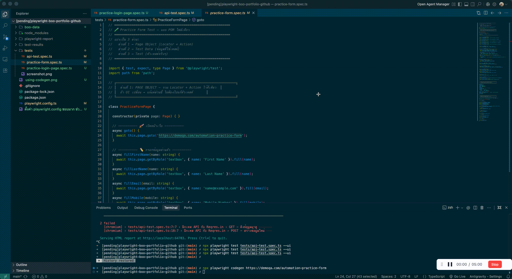
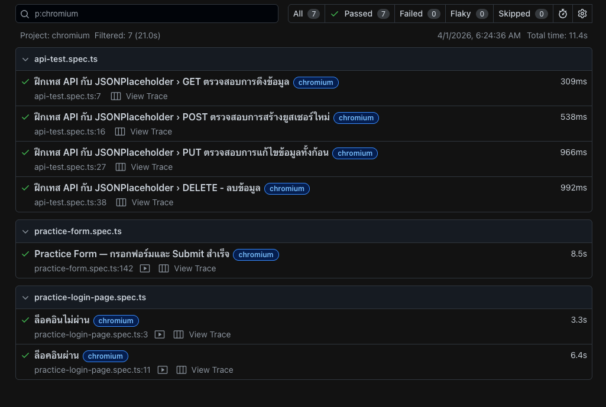
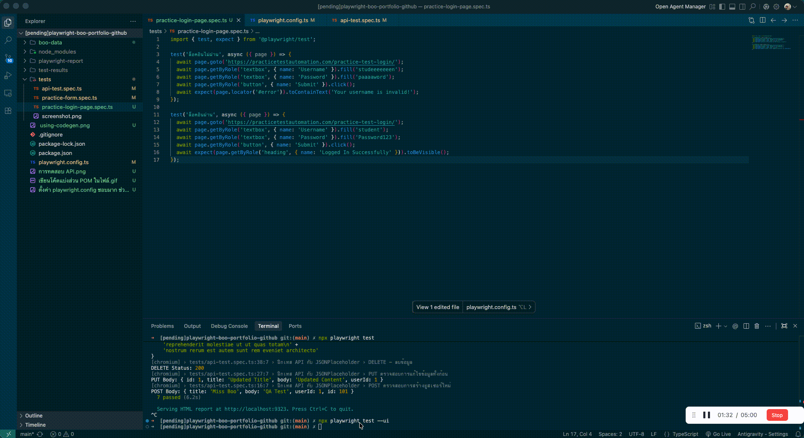
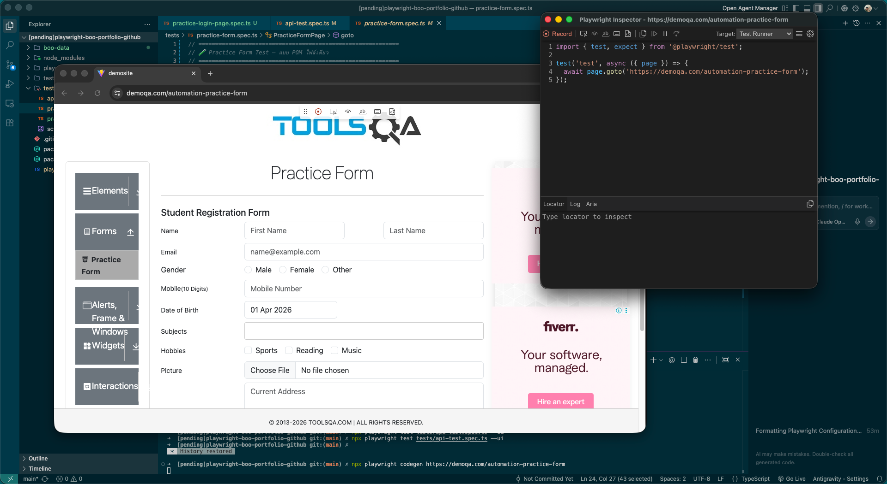

# 🎭 Playwright Testing Portfolio : Panthawit Chumthong

Hey there! 👋 This is my Playwright portfolio — a project I built to practice and showcase my skills in both Web UI and API automated testing, all within a single codebase.

---

## 🧪 The Three Test Suites

### 📌 Test 1: Login Page — Positive & Negative Testing

**Target:** [Practice Test Automation — Login Page](https://practicetestautomation.com/practice-test-login/)

I wrote two test cases here — the first is a **Negative test** where I entered wrong credentials and verified that the error message `"Your username is invalid!"` actually showed up. The second is a **Positive test** where I logged in with valid credentials and checked for the `"Logged In Successfully"` heading.

Simple stuff, but essential — a system needs to both "let the right people in" and "keep the wrong ones out."

### 📌 Test 2: Practice Form — Complex UI Automation with POM

**Target:** [DemoQA — Automation Practice Form](https://demoqa.com/automation-practice-form)

This is the most complex test in this portfolio. I automated a full student registration form covering every common UI element — text inputs, radio buttons, a date picker that requires month/year navigation, autocomplete dropdowns, checkboxes, file upload, cascading dropdowns (State → City), and finally form submission with result verification.

I structured it using the **Page Object Model (POM)** — locators and actions live in a single reusable class, test data is extracted into a separate object, and the test flow reads like plain steps. If the UI changes, I only need to update one place.


*(The actual code — locators, data, and test logic are clearly separated.)*

### 📌 Test 3: API Testing — Full CRUD with JSONPlaceholder

**Target:** [JSONPlaceholder API](https://jsonplaceholder.typicode.com/)

I tested all four HTTP methods — **GET** to fetch post #1 and assert status `200` with the correct `id`, **POST** to create a new post and assert status `201`, **PUT** to fully update a post and verify the title changed, and **DELETE** to remove a post and confirm status `200`.

Everything runs through Playwright's built-in `request` context — no external HTTP library needed.


*(My API test code — with clear Thai comments explaining each CRUD operation.)*

---

## ✅ The Results — 7/7 Tests Passed

All three test files ran with **7 test cases, 0 failures**, completed in 21 seconds.


*(Playwright HTML Report — 7/7 passed, 0 failed, 0 flaky.)*

The report comes with **Screenshots** captured after every test, **Videos** recording each run, and **Traces** that let me step through actions one by one with `npx playwright show-trace`.


*(Watch the actual run — browser automation and API calls executing in parallel.)*

---

## 🌟 Why I Chose Playwright

Before this, I used **Selenium** for UI testing and **Postman** for API testing — two separate tools, two separate workflows. They both work fine, but after trying **Playwright**, I found it much more convenient to handle everything in one project.

**Compared to Selenium** — Playwright has built-in auto-wait so I don't need explicit waits, it runs faster with headless mode and native parallelism, installs all browsers in one command, ships with an HTML report that includes screenshots/videos/traces, and has Codegen that generates test code just by clicking around a webpage.

**Compared to Postman** — Test files are plain `.ts` files that work with Git natively and are easy to review, they run directly in any CI/CD pipeline without needing Newman, and the whole thing is 100% free and open-source.

**That said** — Playwright is code-based, so I need to know TypeScript or JavaScript, which isn't as easy as clicking buttons in Postman. But the lifesaver here is **Codegen** (`npx playwright codegen`) — it opens a browser, I just click around, and Playwright writes the code for me automatically. It speeds up the initial test creation significantly.


*(Codegen in action — I just interact with the webpage and Playwright writes the code in real-time.)*

---

## 🧩 Skills I Gained from This Project

Working on this project let me practice and apply skills across several areas:

**Architecture** — I used Page Object Model to separate locators and actions from test logic, Data-Driven Testing to extract test data into a standalone object, and organized tests into groups with `test.describe`.

**Web UI Interactions** — Form filling, radio buttons, checkboxes, date picker with month/year navigation, autocomplete dropdowns, file upload via `setInputFiles`, cascading dropdowns, and form submission with validation.

**API Testing** — Full CRUD coverage (GET, POST, PUT, DELETE) with status code and response body validation, all using Playwright's built-in `request` context.

**Configuration** — I set up `playwright.config.ts` from scratch — screenshots, video recording, trace collection, HTML reporting, parallel execution, and multi-browser project setup.


*(My playwright.config.ts — screenshots, videos, and traces enabled on every run for effortless debugging.)*

---

## 🛠️ Try It Yourself

**Tech Stack:** Playwright `v1.58.2` + TypeScript + Node.js

```
playwright-boo-portfolio-github/
├── tests/
│   ├── practice-login-page.spec.ts   ← Login positive/negative tests
│   ├── practice-form.spec.ts         ← Complex form with POM pattern
│   └── api-test.spec.ts              ← CRUD API testing
├── boo-data/
│   └── img-for-test.png              ← Test asset for file upload
├── playwright.config.ts              ← Fully documented configuration
└── package.json
```

```bash
# Install
npm install
npx playwright install

# Run all tests
npx playwright test

# View the report
npx playwright show-report
```

---

_Thanks for checking out my portfolio — feel free to explore the code!_
