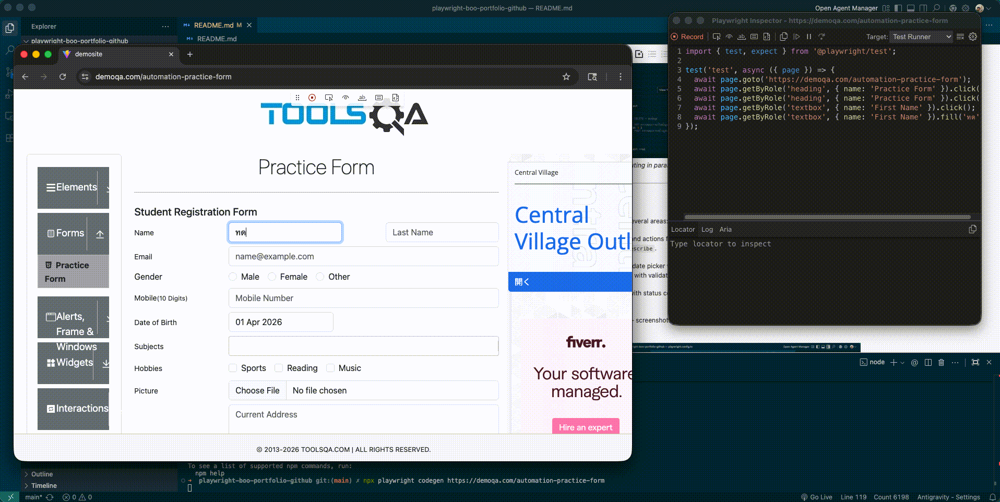
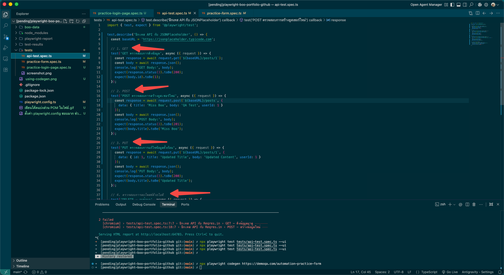
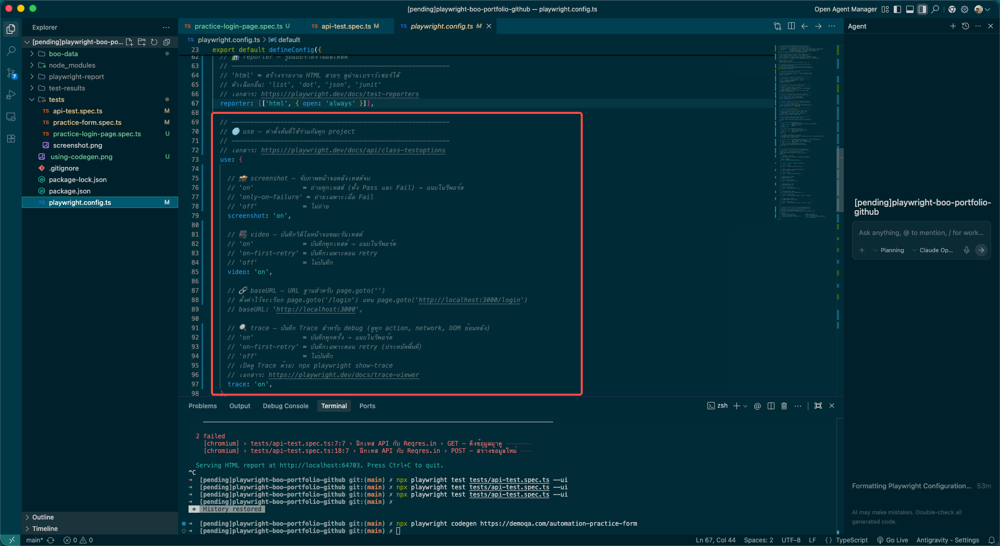

# 🎭 Playwright: The All-in-One Automation Powerhouse

Welcome to the Playwright section of my portfolio! 👋 

This project is a showcase of how I use **Playwright** to handle both Web UI and API automated testing within a single, unified codebase. It’s the ultimate "one-tool army" for modern QA.

---

## 🌟 Why Playwright? (One Tool > Two Tools)

Before this, I used **Selenium** for UI and **Postman** for APIs. They are great, but Playwright is a game-changer:
-   **Speed:** It’s lightning fast with native parallel execution.
-   **Stability:** Built-in "Auto-wait" means fewer flaky tests.
-   **Convenience:** No more switching between apps. My UI tests and API tests live together in harmony.

---

## 🏗️ The Journey: My Playwright Workflow

I’ve structured this project to demonstrate versatility across different testing scenarios.

### Step 1: The Magic of Codegen
Test creation doesn't always have to start from scratch. I use **Playwright Codegen** to record my interactions with the browser and automatically generate the initial test scripts. It’s a massive time-saver!


*(I click, Playwright writes. Simple but powerful.)*

### Step 2: Complex Web UI Automation (POM Pattern)
I automated a complex student registration form covering every element: radio buttons, date pickers, file uploads, and cascading dropdowns. To keep the code clean and maintainable, I used the **Page Object Model (POM)**.


*(Keeping locators and logic separated for rock-solid maintainability.)*

### Step 3: API Testing (Full CRUD)
I didn't stop at the UI. I used Playwright's built-in `request` context to perform full CRUD operations (GET, POST, PUT, DELETE) against a mock API. No extra libraries required!


*(My API tests with clear English and Thai comments for every step.)*

---

## ✅ The Verdict: 100% Success

All tests executed flawlessly. Playwright provides a beautiful HTML report that includes **Screenshots**, **Videos**, and **Traces** for every single run.

<p align="center">
  
  
</p>
*(7/7 Tests Passed in just 21 seconds!)*

---

## 🧩 Under the Hood: Configuration Mastery

I’ve fine-tuned the `playwright.config.ts` to ensure we get the best debugging data without sacrificing performance. I enabled automatic video recording and trace collection for every failure.


*(My custom configuration for high-visibility debugging.)*

---

## 🛠️ Tech Stack & Structure

-   **Stack:** Playwright v1.58.2 + TypeScript + Node.js
-   **Pattern:** Page Object Model (POM) + Data-Driven Testing

```bash
# How to run it
npm install
npx playwright install
npx playwright test
```

---

*Thank you for exploring my Playwright journey! I’m ready to build fast, reliable, and all-in-one automation suites for your next project.* 🎭⚡
