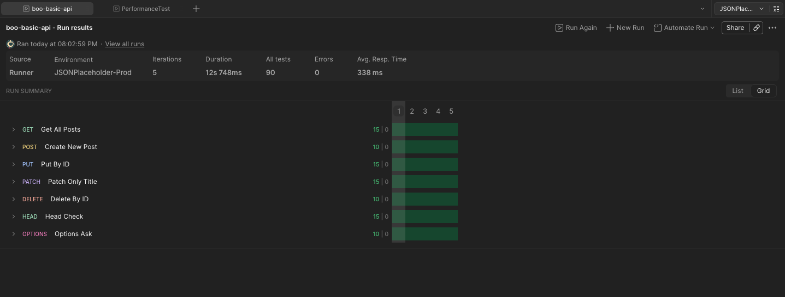
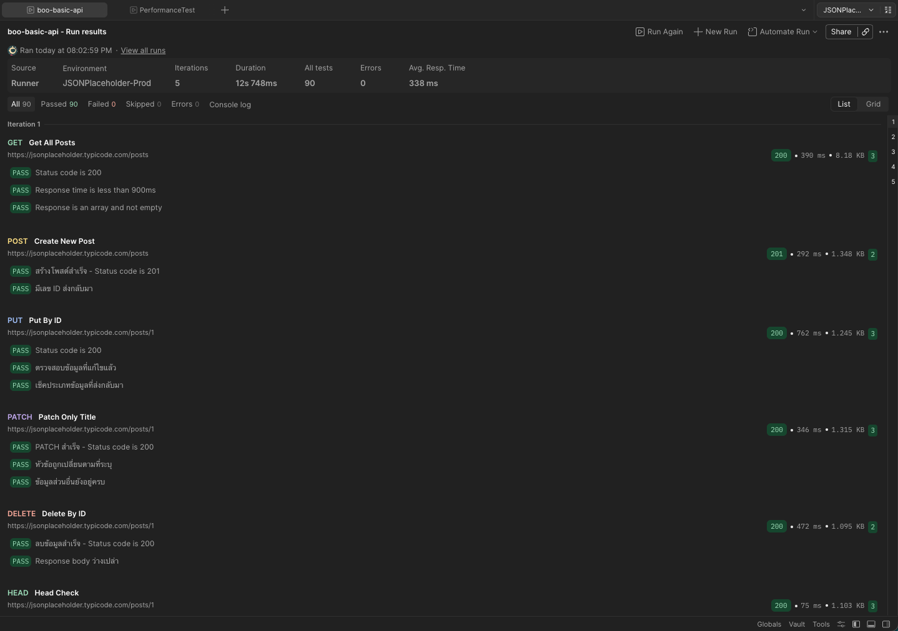
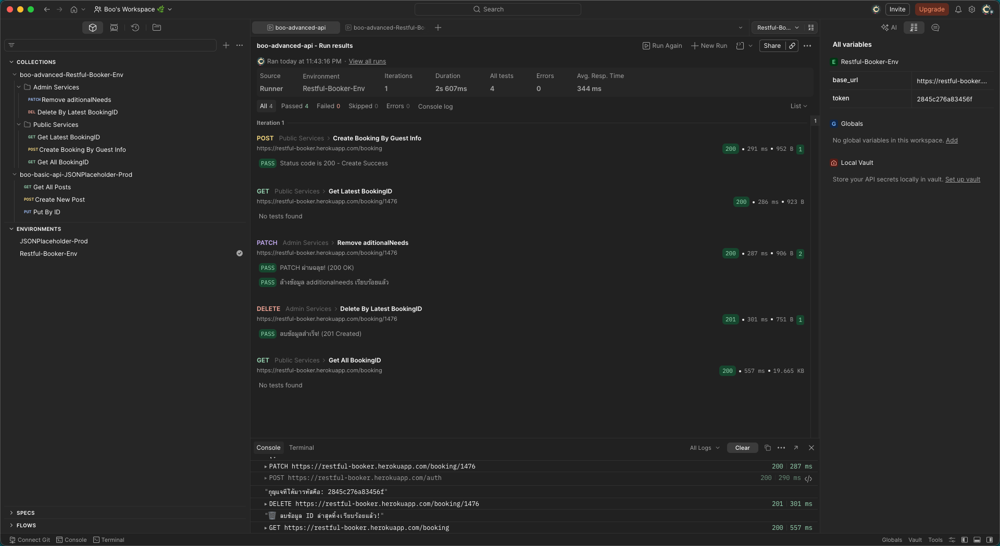
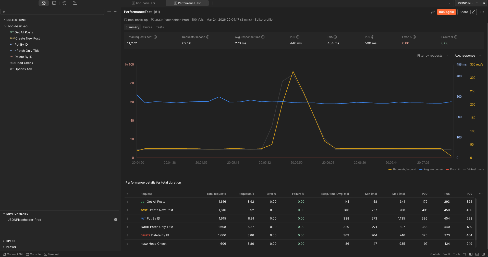
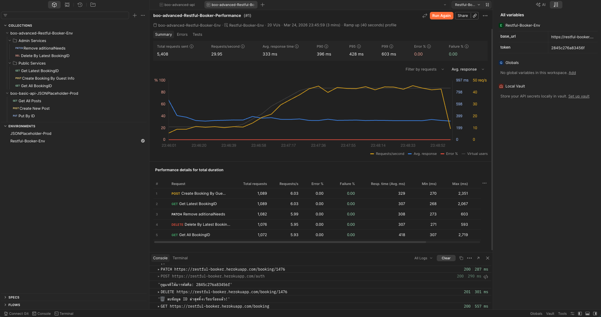

# 🚀 Postman API Testing Portfolio : Panthawit Chumthong

Hello and welcome to my API Testing Portfolio!

As a Quality Assurance (QA) tester, my goal is to ensure software works flawlessly from the inside out. While testing the user interface (clicking buttons and filling forms) is important, I believe it's equally crucial to test the data layer behind the scenes—the APIs.

If the underlying data structure (the API) is functioning correctly and securely, it prevents countless bugs from ever reaching the front-end user experience.

In this portfolio, I use **Postman** to demonstrate my ability to communicate directly with APIs, validate their responses, and automate testing workflows before a user interface is even built.

---

## 🙏 Acknowledging the Demo APIs

To build this portfolio, I utilized two excellent sandbox environments. I want to sincerely thank them for providing the resources to practice and showcase these skills:

- **[JSONPlaceholder](https://jsonplaceholder.typicode.com/)**: A mock web service I used to showcase basic data creation, reading, and editing.
- **[Restful-Booker](https://restful-booker.herokuapp.com/)**: A more complex mock hotel booking system that required me to handle login authentication and security tokens.

---

## 🎯 What I Built (My Capabilities)

I created this project to practically demonstrate my day-to-day API testing workflows. Here is a breakdown of what I can do:

### 1. Basic Data Transfer Testing (CRUD Operations)

I started by testing the foundational actions: fetching data (GET), creating new data (POST), modifying data (PUT/PATCH), and deleting data (DELETE). I wrote assertions to ensure the server responds with the exact Status Codes and data structures expected.

*(My run results covering all basic data management tests, showing successful validations across the board.)*

### 2. Mocking Data and Automated Scripting (Pre-request & Test Scripts)

To avoid manual repetitive tasks, I use JavaScript within Postman to automate my workflow:

- **Pre-request Scripts**: I wrote scripts to dynamically generate fake names and random prices (mock-up data) immediately prior to sending a request. This ensures my test data is always fresh and varied.
- **Test Scripts**: I wrote automated assertions so Postman instantly checks the server's response against my rules, eliminating the need for me to manually verify the data payloads.

*(In this run, I successfully extracted an access Token and dynamically generated data, passing them seamlessly through a chain of subsequent requests.)*

### 3. System Performance Testing

An application that works perfectly for a single user might struggle under a heavy load. Alongside functional testing, I ran Performance Tests to observe how the APIs handle multiple virtual users sending data simultaneously, ensuring response times remain stable and acceptable.

*(My performance test graph, observing the simple mock system's stability when handling rapid requests.)*

*(Performance testing applied to the more complex booking system to ensure it doesn't break under pressure.)*

---

## 📂 Technical Documentation

For a deeper dive into the exact assertions, scripts, and variable configurations I used throughout these tests, please feel free to explore my detailed Visualized JSON documentation:

🔹 **[Basic System Documentation (JSONPlaceholder)](boo-basic-api/boo-basic-api-docs.md)**
🔹 **[Advanced System Documentation (Restful-Booker)](boo-advance-api/boo-advanced-api-docs.md)**

Thank you for taking the time to review my work! 🚀
