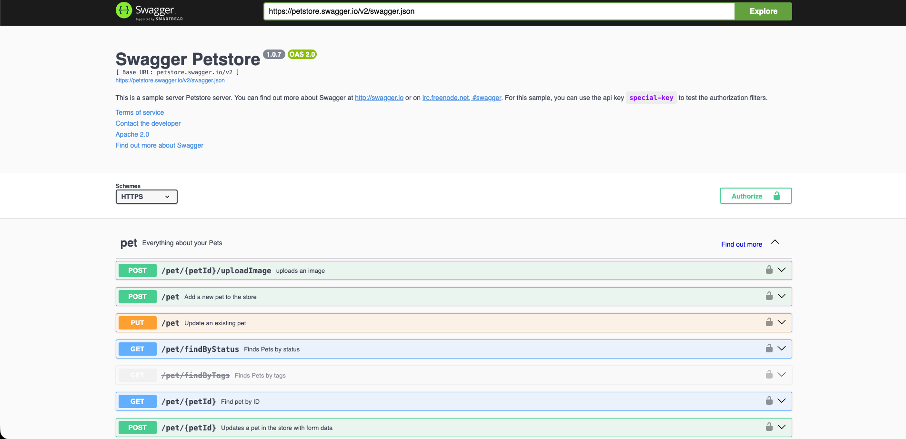
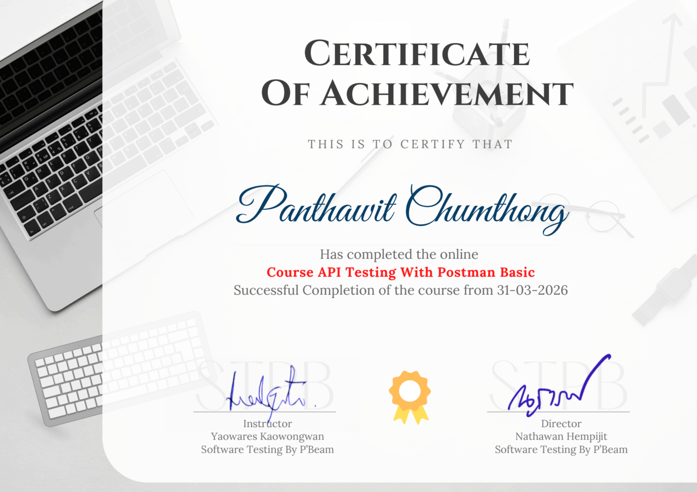

# 🚀 Postman: Testing Software from the "Inside Out"

Welcome to the API wing of my portfolio! 🌐

While testing the user interface (UI) is vital, I believe a truly robust product starts with a solid foundation. That’s why I dive deep into the data layer—the APIs. By ensuring the "pipes" of the system are functional, secure, and fast, we can prevent countless bugs from ever reaching the user's screen.

In this section, I use **Postman** to showcase how I validate business logic, automate data flows, and stress-test performance—often before a single pixel of the front-end is even designed.

---

## 🙏 The Testing Sandboxes

Special thanks to the mock environments that made these tests possible:
-   **JSONPlaceholder:** My go-to for mastering basic data management.
-   **Restful-Booker:** A complex booking system where I practiced handling security tokens and session authentication.

---

## 🏗️ The Journey: My API Testing Workflow

I’ve structured my API testing into three progressive steps to ensure complete coverage.

### Step 1: Mastering the Basics (CRUD Operations)
Every great API starts with being able to Create, Read, Update, and Delete data correctly. I wrote assertions to verify that every request returns the perfect Status Code and the exact data structure expected.

  
  

*(100% success across all foundational data operations)*

### Step 2: Automation & "Smart" Testing
Manual testing is slow. I use **JavaScript** within Postman to make my tests "think":
-   **Dynamic Data:** Using scripts to generate random names and prices on the fly.
-   **Chain Reactions:** Automatically extracting a "Token" from a login request and passing it to the next task—eliminating manual copy-pasting.

*(Automated flow: Extracting tokens and generating dynamic booking data seamlessly)*

### Step 3: Pushing the Limits (Performance)
A system that works for one person might fail for a thousand. I ran performance tests to simulate high-traffic scenarios, ensuring that our "foundation" stays rock-solid even under pressure.

  
  

*(Monitoring response times and stability during rapid-fire requests)*

---

## ⚡ Bonus Power-up: Swagger (OpenAPI) Mastery

A big part of my workflow involves **Swagger**. It’s the "instruction manual" for APIs. My favorite pro-tip? Configuring a request in Swagger UI and importing the **cURL command** directly into Postman. It saves time and lets me get straight to the interesting part—finding bugs!

---

## 🏆 Proof of Skill

My API testing foundation is validated by a professional certification in Postman.

---

## 📂 Deep Dive: Technical Documentation

If you're a fellow tech enthusiast, feel free to explore the raw logs, JSON scripts, and full assertion details here:

🔹 **[JSONPlaceholder: Basic System Specs](boo-basic-api/boo-basic-api-docs.md)**
🔹 **[Restful-Booker: Advanced Logic Specs](boo-advance-api/boo-advanced-api-docs.md)**

---

*Thank you for exploring how I ensure quality from the inside out. Let’s build something unbreakable!* 🚀
