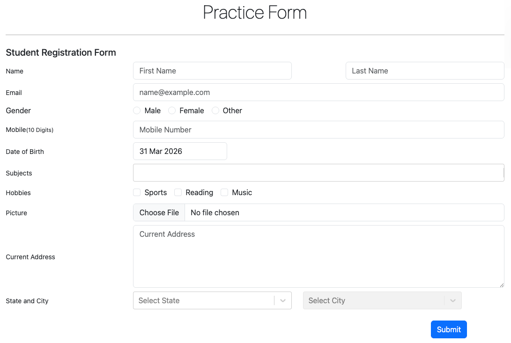
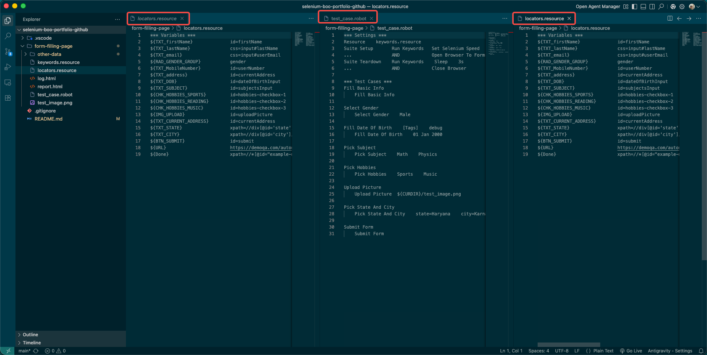
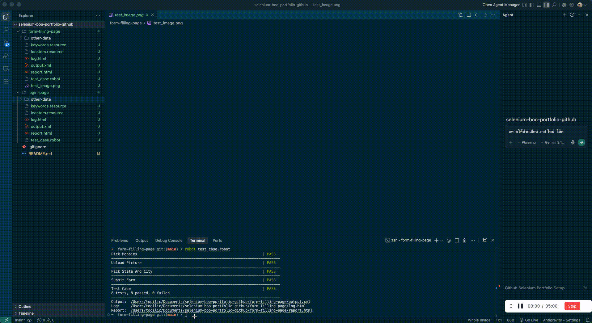
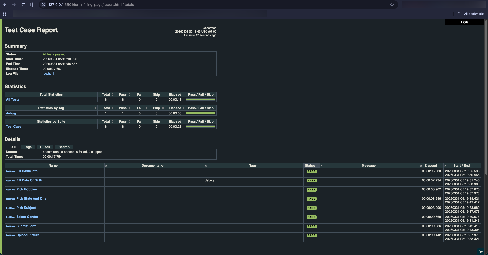

# 🤖 My Journey with Robot Framework and Selenium Library

Hello there! 👋 Welcome to a small but special piece of my Automation Testing Portfolio.

If you're reading this, you might be wondering—what exactly goes into automating a web browser, and why do we even do it? Let me share a little story about the tools I used and the project I built.

---

## 🧐 What Are Robot Framework & Selenium Library?

Imagine having a tireless digital assistant whose only job is to open a browser, click buttons, and type things precisely as you ask, over and over again. That's essentially what we are doing!

- **Robot Framework**: Think of this as the "brain." It is an open-source automation framework that is surprisingly easy to read. Instead of writing complex, messy code, it allows us to write tests in almost plain English (keyword-driven). *Advantage:* Highly readable, easy for non-programmers to understand, and generates beautiful built-in reports.
- **Selenium Library**: This is the "hands." It is a web testing library that plugs directly into Robot Framework and takes control of the web browser itself. *Advantage:* It can interact with almost any web element (buttons, dropdowns, text boxes) exactly like a real human would, but at lightning speed!

Together, they take away the tedious, repetitive manual work and replace it with fast, rock-solid automation.

---

## 📂 The Project: Taming a Complex Web Form

In this repository, you'll find a project called `form-filling-page`.

The mission was simple but challenging: automate the process of filling out a tricky web form packed with text boxes, dropdown menus, checkboxes, file uploads, and a dynamic date picker.

### 1. The Playground

To a normal user, it looks like a standard registration page. To an automated script, it's an obstacle course of different web elements demanding specific handling.



### 2. Writing the Code

Before the magic happens, all the instructions must be carefully scripted. Using Robot Framework makes the process incredibly readable, almost like writing a test checklist in plain English. Here is an example of what the code looks like:



### 3. Seeing it in Action!

When the script runs, it takes over the browser, moving and typing flawlessly. It's honestly satisfying to watch!



---

## 💡 A Proud Problem-Solving Moment

During this project, I hit a roadblock with the **Date-picker field**.

Usually, the process is straightforward: tell the bot to "clear" the field and type the new date. But I discovered a strange bug! If the default date was completely deleted, the webpage would crash and go entirely blank.

I had never encountered this before. After brainstorming, I realized I needed to outsmart the UI. Instead of using the standard "clear" command, I instructed the bot to simulate pressing **`Command/Ctrl + A`** (Select All) and immediately type the new date over it.

This creative workaround completely bypassed the bug, replaced the text smoothly, and successfully completed the form. It was a fantastic reminder that automation often requires outside-the-box thinking!

---

## 🧩 Behind the Scenes: How the Code is Organized

To keep things neat and professional, I didn't just throw all the code into one messy file. I used a structure called the **Page Object Model (POM)**, dividing the work into three parts:

1. 🗺️ **The Map (`locators.resource`)**: This stores the exact "addresses" (HTML IDs or XPaths) of every element on the page. If the page changes later, I only update this one file!
2. ⚙️ **The Actions (`keywords.resource`)**: This is a dictionary of custom commands. I hide the complex tech details here and create simple actions like `Fill In First Name`.
3. 📝 **The Blueprint (`test_case.robot`)**: This is the actual test script. Because of the previous two files, this script reads beautifully, almost like a simple checklist.

---

## ✅ The Results

How do we know it actually worked? The framework automatically generates a detailed report, showing every step took and whether it passed or failed.



I've pre-run this test, and it achieved a **100% Pass Rate**.

You can check out the live reports right here:

- 🟢 [**View The Full Test Report**](https://github.com/panwyyt/myboo-resume/blob/main/selenium/form-filling-page/report.html)
- 🟢 [**View The Detailed Step-by-Step Log**](https://github.com/panwyyt/myboo-resume/blob/main/selenium/form-filling-page/log.html)

*(💡 Ctrl/Cmd + Click to open in a new tab)*

---

## 🛠️ For The Technical Reviewers

If you'd like to dive into the code yourself, here are the technical details.

### Technology Stack

- **Robot Framework**: Core automation framework
- **SeleniumLibrary**: Web manipulation library
- **Python**: Core scripting engine

### How to Run Locally

1. Ensure Python is installed.
2. Install the necessary libraries:
   ```bash
   pip install robotframework
   pip install robotframework-seleniumlibrary
   ```
3. Ensure you have a compatible browser driver (e.g., `chromedriver`) in your system PATH.
4. Execute the tests:
   ```bash
   cd form-filling-page
   robot test_case.robot
   ```

   The test results (`log.html` and `report.html`) will be generated inside the project folder.

---

*Thank you for reading my story and exploring my portfolio. I hope it gives you a clear picture of my approach to UI test automation!*
