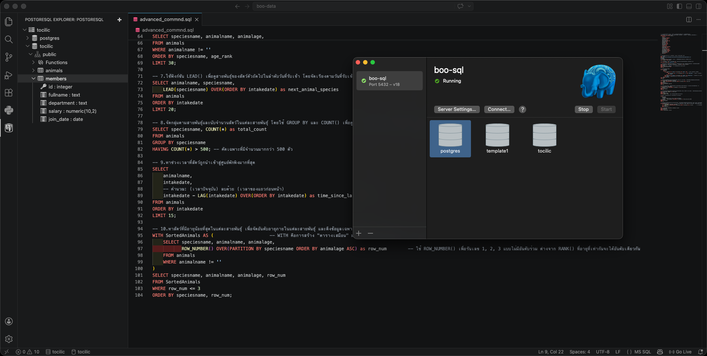

# 🗄️ My SQL & Database Testing Journey

Welcome to my database testing portfolio! This repository is a reflection of my journey in learning how to effectively test what goes on "behind the scenes" of an application.

## 🚀 About This Portfolio

To put my SQL skills to the test, I decided to practice using a real-world dataset: **"Adoptions by Breed and Date"**. A huge thanks to the original creators! You can find the raw dataset here: [Analyzing Adoption Trends at the Bloomington Animal Shelter](https://www.kaggle.com/datasets/thedevastator/analyzing-adoption-trends-at-the-bloomington-ani).

I have divided my work in this repository into two distinct projects:

1. **Project 1 (Foundational SQL):** First, I wanted to isolate and demonstrate my foundational SQL skillset (such as basic CRUD operations and table creation). This part does *not* use the complex adoption dataset but instead uses independent mock data. You can find this work in [`boo-data/ basic_command.sql`](./boo-data/%20basic_command.sql).
2. **Project 2 (Advanced SQL & Analytics):** Next, I challenged myself with more complex commands. For this part, I imported the actual adoption dataset mentioned above and wrote advanced queries utilizing Window Functions, Conditional Logic, and CTEs. You can find this work in [`boo-data/advanced_commnd.sql`](./boo-data/advanced_commnd.sql).

---

## 📂 Project Structure

All portfolio queries and resources are located inside the [`boo-data/`](./boo-data/) directory:

| File Name                                                | Description                                                                                                                                                 |
| -------------------------------------------------------- | ----------------------------------------------------------------------------------------------------------------------------------------------------------- |
| 📜[`basic_command.sql`](./boo-data/%20basic_command.sql)  | **Basic CRUD Operations:** Demonstrates table creation, schema design, and basic data manipulation using Thai mock data.                              |
| 📜[`advanced_commnd.sql`](./boo-data/advanced_commnd.sql) | **Advanced Data Analysis:** Queries a real-world `animals` shelter dataset (10,000+ rows) using advanced techniques like CTEs and Window functions. |
| 📊[`animal-data-1.csv`](./boo-data/animal-data-1.csv)     | The raw dataset containing 10,000+ records used for the advanced queries.                                                                                   |

### 💻 Code Snippets (Click to Expand)

<details>
<summary><b>1. Basic SQL Commands</b> (<code>basic_command.sql</code>)</summary>

```sql
-- Create table with constraints
CREATE TABLE members (
    id SERIAL PRIMARY KEY,
    fullname TEXT NOT NULL,
    department TEXT,
    salary NUMERIC(10, 2),
    join_date DATE DEFAULT CURRENT_DATE
);

-- Select and Filter Data
SELECT fullname, salary FROM members WHERE salary >= 35000;

-- Update and Delete Data
UPDATE members SET salary = 36000.00 WHERE id = 11;
DELETE FROM members WHERE id = 1;
```

</details>

<details>
<summary><b>2. Advanced Data Analysis</b> (<code>advanced_commnd.sql</code>)</summary>

```sql
-- Categorize data using CASE WHEN
SELECT animalname, animalage,
       CASE 
           WHEN animalage LIKE '%year%' THEN 'Adult/Senior'
           WHEN animalage LIKE '%month%' OR animalage LIKE '%week%' THEN 'Baby/Kitten'
           ELSE 'Adult'
       END AS age_group
FROM animals LIMIT 20;

-- Find rank using Window Functions (RANK)
SELECT speciesname, animalname, animalage,
       RANK() OVER(PARTITION BY speciesname ORDER BY animalage DESC) as age_rank
FROM animals WHERE animalname != ''
ORDER BY speciesname, age_rank LIMIT 30;
```

</details>

---

## 🧰 Technical Skills I Have Demonstrated

Here is a breakdown of the technical skills I've applied and demonstrated in this repository using **PostgreSQL**:

- **Basic SQL (CRUD):** `CREATE`, `INSERT`, `UPDATE`, `DELETE`, `DROP`, `SELECT`, Filtering with `WHERE`.
- **Advanced SQL / Data Analysis:**
  - Window Functions (`RANK()`, `LEAD()`, `LAG()`) for complex sequences.
  - Conditional Logic (`CASE WHEN`) for dynamic data grouping.
  - Aggregation & Filtering (`GROUP BY`, `COUNT`, `HAVING`).
  - Common Table Expressions (CTEs - `WITH` clauses) for readable query structuring.
- **Database Management:** Establishing `PRIMARY KEY`s and importing large `CSV` datasets via `COPY`.
- **Database Architecture:** Understanding Entity-Relationship (ER) Diagrams, PK/FK relationships, and schema normalization (as shared in my story below).
- **Server Simulation (Docker):** Capable of spinning up localized database servers (like **MS SQL Server**) using Docker to create isolated testing environments on the fly.

---

## 📸 Proof of Concept (Working with Tools)

I am highly comfortable using real industry tools to interact with databases and verify my test results. Here are some snapshots of me using these tools to run the queries in this project!

**Testing & Querying via VSCode Database Tools**


**Testing & Querying via pgAdmin4**


---

## 🚀 How to Run It Yourself

1. Install **PostgreSQL** (I used Postgres.app & pgAdmin4 on macOS).
2. Connect to your test database.
3. Execute the `basic_command.sql` script to see basic table creation.
4. Import the `animal-data-1.csv` file using the `COPY` configuration inside `advanced_commnd.sql`.
5. Run the analytics queries and watch the data magic happen!

---

## 📖 My "Behind the Scenes" Story

### 1. Moving Beyond the Front-end

When I first started exploring software testing, my focus was almost entirely on the front-end. I thought that if I filled out a registration form, clicked "Submit," and saw a "Success" message pop up, my job was done.

But as I gained more experience, I started asking myself a critical question: **"When I click submit, where does that data actually go?"**

That curiosity led me straight to the Database.

### 2. Discovering the Power of SQL

I quickly realized that just trusting the front-end success message wasn't enough to be a thorough QA. I needed a way to verify that the customer's information actually arrived exactly as they typed it, and that it was saved correctly.

To achieve this, I dedicated myself to learning **SQL** (Structured Query Language). It became the perfect tool for me to dive directly into the database and validate data integrity with my own eyes.

### 3. Digging Deeper: Schemas and Relationships

As I practiced, I learned that testing databases effectively required more than just knowing basic commands like creating or deleting data (CRUD). I realized I needed to truly understand the **Schema** (the database's blueprint) and how different tables connect using **Primary Keys (PK)** and **Foreign Keys (FK)**.

Learning how to read Entity-Relationship Diagrams was a fun challenge. I remember coming up with a trick to memorize table relationships by asking myself a couple of simple questions. For instance, when trying to understand the relationship between **Students** and **Faculties**, I would ask:

- *1 Student belongs to how many Faculties?* -> (Usually just 1 Faculty)
- *1 Faculty can have how many Students?* -> (Many Students)
- **My Conclusion:** Since 1 Faculty holds many Students, this relationship is **1:N (One-to-Many)**.

### 4. My Shopping Cart "Aha!" Moment

My understanding of database architecture really clicked when I thought about a simple online shopping cart.

Initially, I assumed an e-commerce database only needed three simple tables: **Customer**, **Product**, and **Order**.

But as I dug deeper into how real databases are structured, I had an "Aha!" moment. I realized that a real system actually needs a fourth table: an **Order Header** (or Receipt Header) to group multiple items bought at the same time into a single receipt summary.

This level of understanding completely changed how I approach testing. Knowing how databases are designed allows me to ensure that the systems I test handle user data logically, helping me catch structural bugs before they even happen!

---

## 🎓 Certification

To ensure I have a strong and standardized foundation, I completed the database testing course from **Software Testing By P'Beam**.

<div align="center">
  
</div>
