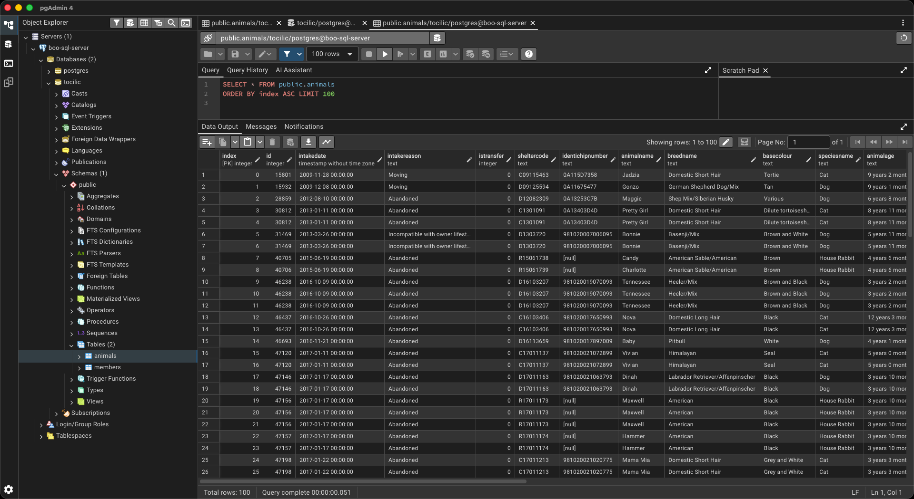

# 🗄️ บันทึกการเดินทางสาย SQL & Database Testing ของผม

ยินดีต้อนรับสู่มุม "หลังบ้าน" ของพอร์ตโฟลิโอผมครับ! 🚀

ในพอร์ตชิ้นนี้ ผมอยากจะส่งต่อแรงบันดาลใจจากการที่ก้าวข้ามจากการตรวจสอบเพียงหน้าบ้าน (Front-end) มาสู่พื้นที่ที่เป็นสมองกลสำคัญของโปรเจกต์ หรือก็คือ "ฐานข้อมูล" (Database) นั่นเอง ผมเริ่มสงสัยว่า "เห้ย แล้วไอ้ข้อมูลที่เรากดส่งไปเนี่ย มันไหลไปลงที่ไหนกันแน่?" และนั่นคือบทบรรเลงที่พาผมมาทำความรู้จักกับ SQL ครับ!

---

## 🚀 ภารกิจ: จากเบสิกสู่เลเวลแอดวานซ์

เพื่อให้เห็นความเก่งกาจของ SQL จริงๆ ผมนำชุดข้อมูลระดับหมื่นแถวจาก **"Adoptions by Breed and Date"** ของศูนย์พักพิงสัตว์เมือง Bloomington มาเป็นโจทย์ฝึกฝน โดยผมขอแบ่งเส้นทางนี้ออกเป็น 2 โปรเจกต์หลักๆ ครับ

### Step 1: วางรากฐาน (CRUD)
ก่อนจะวิ่ง เราต้องหัดเดิน! ผมเริ่มจากการฝึกออกแบบ Schema พื้นฐานและการจัดการข้อมูล (CRUD) ผมใช้ข้อมูลสมมุติขึ้นมาเพื่อทดสอบให้มั่นใจว่า คำสั่งพื้นฐานของผมนั้นแม่นยำและรัดกุม 100%
*(ไฟล์อ้างอิง: [`boo-data/basic_command.sql`](./boo-data/%20basic_command.sql))*

### Step 2: วิเคราะห์ข้อมูลสายลึก (Window Functions & CTEs)
ผมขยับมาใช้ข้อมูลสัตว์เลี้ยง 10,000+ รายการ มาลองของกับคำสั่งสุดโหด! ผมเขียนคิวรีจัดหนักทั้ง **CTEs**, **Window Functions** (RANK, LEAD, LAG) และการใช้เงื่อนไข **CASE WHEN** เพื่อเจาะลึกหาคำตอบจากตัวเลขจำนวนมหาศาล
*(ไฟล์อ้างอิง: [`boo-data/advanced_commnd.sql`](./boo-data/advanced_commnd.sql))*

---

## 📸 พิสูจน์ด้วยการลงมือทำ: เครื่องมือคู่กาย

ผมพร้อมลุยกับการใช้งานทูลมาตรฐานในโลกการทำงานจริงครับ ไม่ว่าจะเป็นการรันคำสั่งผ่าน IDE ยอดนิยม หรือหน้าจอจัดการฐานข้อมูลโดยเฉพาะ เพื่อให้เห็นผลลัพธ์การคิวรีที่แม่นยำที่สุดครับ

  
  

*(บรรยากาศตอนรัน PostgreSQL ผ่าน VSCode Database Tools และ pgAdmin4)*

---

## 💡 ช็อต "ร้องอ๋อ!": ทำไมโครงสร้างถึงสำคัญ?

เรื่องสถาปัตยกรรมของดาต้าเบสที่เคยยากๆ มันสว่างวาบเข้าใจแจ่มแจ้งตอนที่ผมไปลองศึกษาเรื่อง **ระบบตะกร้าสินค้า (Shopping Cart)** ครับ ผมถึงบางอ้อเลยว่าระบบที่ดีมันต้องการมากกว่าแค่ตาราง "ลูกค้า" และ "คำสั่งซื้อ"—มันต้องการตาราง **หัวบิล (Order Header)** มาช่วยรวบยอดไอเทมต่างๆ ให้อยู่ในใบเสร็จใบเดียว!

การศึกษาเรื่อง ** Entity-Relationship (ER) Diagrams** และความสัมพันธ์แบบ **1:N (One-to-Many)** ได้เปลี่ยนวิธีการเทสของผมไปตลอดกาลครับ ตอนนี้ผมสามารถดักจับบั๊กในระดับโครงสร้างได้ ตั้งแต่มันยังไม่โผล่ไปหลอกหลอนผู้ใช้งานหน้าบ้านเลยด้วยซ้ำ!

---

## 🏆 ใบประกาศการันตีวรยุทธ

เพื่อให้แน่ใจว่าสกิลพื้นฐานของผมเป๊ะตามมาตรฐานสากล ผมเลยจัดหนักเรียนจบหลักสูตร Database Testing เฉพาะทางมาเรียบร้อยครับ

  

---

## 🛠️ อยากขุดดูโค้ดไหมครับ? เชิญได้เลย!

ลองแวบเข้าไปส่องไฟล์คิวรีและข้อมูลฉบับจริงใน Repo ของผมได้ตามใจชอบเลยครับ:
- 📜 [**สคริปต์ CRUD พื้นฐาน**](./boo-data/%20basic_command.sql) 
- 📜 [**สคริปต์คิวรีสายโหดแอดวานซ์**](./boo-data/advanced_commnd.sql)
- 📊 [**ชุดข้อมูลดิบสัตว์เลี้ยง (CSV)**](./boo-data/animal-data-1.csv)

---

*ขอบคุณทุกท่านที่มารับชมการเดินทางในโลกของข้อมูลของผมนะครับ! การเข้าใจลอจิกเบื้องหลังของดาต้าเนี่ยแหละครับ ที่ทำให้งานทดสอบมีสุนทรียภาพที่สุด* 🗄️✨
